# minilogue xd POLYPHONIC ANALOGUE SYNTHESIZER

# minilogue xd module

POLYPHONIC ANALOGUE SYNTHESIZER

## Owner's Manual

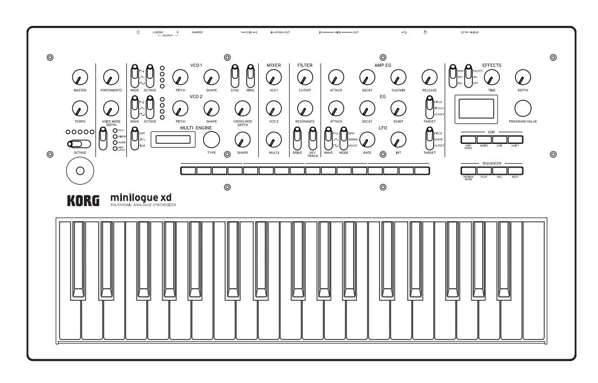

<!-- AI Image Description: _page_0_Picture_4.jpeg -->
> **[Image: _page_0_Picture_4.jpeg]** Full front-panel overview of the Korg Minilogue XD polyphonic analogue synthesizer (keyboard version). The image is a detailed line drawing showing the complete instrument from above. At the top-left is the KORG logo and 'minilogue xd' branding with the subtitle 'POLYPHONIC ANALOGUE SYNTHESIZER'. The panel is divided into clearly labeled sections from left to right: MASTER controls (master volume knob, tempo knob), VOICE MODE section, VCO 1 section (with WAVE, OCTAVE, PITCH, SHAPE knobs and a SYNC toggle), VCO 2 section (with WAVE, OCTAVE, PITCH, SHAPE knobs and a CROSS MOD DEPTH knob), MULTI ENGINE section (with TYPE selector switch, SHAPE knob, and a small push-button), MIXER section (with VCO 1, VCO 2, and MULTI level sliders), FILTER section (with CUTOFF and RESONANCE knobs, plus DRIVE and KEY TRACK sliders), AMP EG section (with ATTACK, DECAY, SUSTAIN, RELEASE sliders), EG section (with ATTACK, DECAY knobs and EG INT knob, plus a TARGET selector), LFO section (with WAVE slider, MODE three-position switch, RATE knob, INT knob, and TARGET selector), EFFECTS section (with SELECT knob, TIME and DEPTH knobs), and a PROGRAM/VALUE knob with display. Below these controls is a row of 16 numbered step buttons, an EDIT section (with EDIT MODE, WRITE, EXIT, SHIFT buttons), and a SEQUENCER section (with MOTION MODE, PLAY, REC, REST buttons). A joystick is located at the far left. The lower portion shows a 37-key keyboard (approximately 3 octaves). Four LEDs appear near the OCTAVE section on the left side.

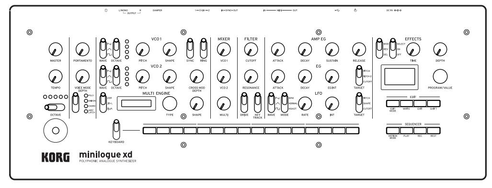

<!-- AI Image Description: _page_0_Picture_5.jpeg -->
> **[Image: _page_0_Picture_5.jpeg]** Detailed close-up line drawing of the Korg Minilogue XD top panel only (without the keyboard), showing all control sections with legible labels. This provides a clearer view of the control layout than the full-instrument image. From left to right: MASTER knob and TEMPO knob on the far left; PORTAMENTO knob and VOICE MODE DEPTH knob below; four OCTAVE LEDs with up/down buttons. VCO 1 section contains WAVE selector, OCTAVE selector, PITCH knob, SHAPE knob, and a SYNC toggle. VCO 2 section contains WAVE selector, OCTAVE selector, PITCH knob, SHAPE knob, and CROSS MOD DEPTH knob. MULTI ENGINE section has TYPE selector (three-position switch or slider), SHAPE knob, and MULTI knob. MIXER section has three vertical sliders for VCO 1, VCO 2, and MULTI levels. FILTER section has CUTOFF knob, RESONANCE knob, DRIVE slider, and KEY TRACK slider. AMP EG section has four sliders: ATTACK, DECAY, SUSTAIN, RELEASE. EG section has ATTACK knob, DECAY knob, EG INT knob, and TARGET selector. LFO section has WAVE slider, MODE three-position switch (BPM/NORMAL/1-SHOT), RATE knob, INT knob, and TARGET selector. EFFECTS section on far right has a SELECT knob (with MOD, REV, DEL, OFF positions indicated), TIME knob, and DEPTH knob. Below the effects: PROGRAM/VALUE knob next to an OLED display. EDIT section with EDIT MODE, WRITE, EXIT, SHIFT buttons. SEQUENCER section with MOTION MODE, PLAY, REC, REST buttons. The KEYBOARD switch is shown between the joystick and the step buttons. Row of 16 numbered step buttons spans the lower portion.

<!-- AI Image Description: _page_0_Picture_6.jpeg -->
> **[Image: _page_0_Picture_6.jpeg]** The KORG company logo rendered in large, bold, solid black capital letters. This is the standard Korg brand wordmark used on their instruments and documentation.

## **Contents**

| Introduction                                  | 3  |
|-----------------------------------------------|----|
| About the owner's manual                      |    |
| Main features                                 |    |
| Block diagram                                 | 4  |
| Controls and connections                      | 5  |
| Front panel controls                          | 5  |
| Rear panel connections                        |    |
| Turning the power on/off                      | 8  |
| Playing the minilogue xd                      | 10 |
| Selecting and playing a program               | 10 |
| Playing in Keyboard mode                      |    |
| Using Favorites                               |    |
| Playing the sequencer                         | 13 |
| Programs                                      | 14 |
| Program architecture                          |    |
| Creating sounds                               |    |
| Saving a program                              | 16 |
| Basic parameters                              | 17 |
| MASTER controls                               |    |
| VCO 1/VCO 2/MULTI ENGINE section              | 18 |
| MIXER section                                 |    |
| FILTER section                                |    |
| EG/LFO section                                |    |
| EFFECTS section                               |    |
| Sequencer                                     | 27 |
| Edit mode                                     |    |
| How to enter the Edit mode                    |    |
| Edit mode parameter list                      |    |
| PROGRAM EDIT mode                             |    |
| SEQ EDIT mode                                 |    |
| GLOBAL EDIT mode                              | 43 |
| Other functions                               |    |
| Tuning                                        |    |
| Poly-chain                                    |    |
| Restoring the factory settings                |    |
| Shortcuts using the SHIFT button              | 52 |
| Using with other devices                      |    |
| Making connections with the SYNC IN/OUT jacks |    |
| Making connections with the CV IN jacks       |    |
| Connecting to a MIDI device or a computer     | 56 |
| Data list                                     | 59 |
| Effects list                                  | 59 |
| Program list                                  | 61 |
| Specifications                                | 66 |
| •                                             |    |
| MIDI Implementation Chart                     | 67 |

## **Introduction**

## **About the owner's manual**

The documentation for this product consists of the following:

- Precautions (included)
- Quick Start Guide (included) Read this manual first. This guide explains the basic operations and other features of the minilogue xd.
- Owner's Manual (what you're reading) This explains how to use the detailed functions of the minilogue xd

#### **Conventions in this manual**

This manual refers to both the minilogue xd and the minilogue xd module collectively as the "minilogue xd". When referring to a specific device, " **xd** " is used to indicate the minilogue xd only, and " **xd-m** " is used to indicate the minilogue xd module only.

The minilogue xd panel diagram is used for the purpose of illustration, unless otherwise noted.

#### **Symbols , Note, Tip**

These symbols respectively indicate a caution, a supplementary note, or a tip.

## **Main features**

- The minilogue xd features an analog signal path with four voices that takes after the Korg prologue analog synthesizer.
- Each voice includes a MULTI ENGINE providing a noise generator, a VPM oscillator, and the possibility to load user programmed oscillators. This instrument combines two VCOs, making it possible to create a wide variety of sounds.
- The FX section is equipped with high quality digital effects (MODULATION, REVERB, DE-LAY).
- 500 programs (200 preset programs and 300 user programs as the factory-set default) can be called up and saved in an instant.
- The minilogue xd has a powerful 16-step polyphonic sequencer.
- •Real-time oscilloscope provides visual feedback of parameter changes.
- Sync In and Sync Out jacks allow you sync analog tempo to and from other devices.
- Two CV IN jacks are available, letting you control the parameters of this instrument using a modular synthesizer or other device.
- **xd-m** In Keyboard mode, you can play or input sequence data using buttons 1–16.

## **Block diagram**

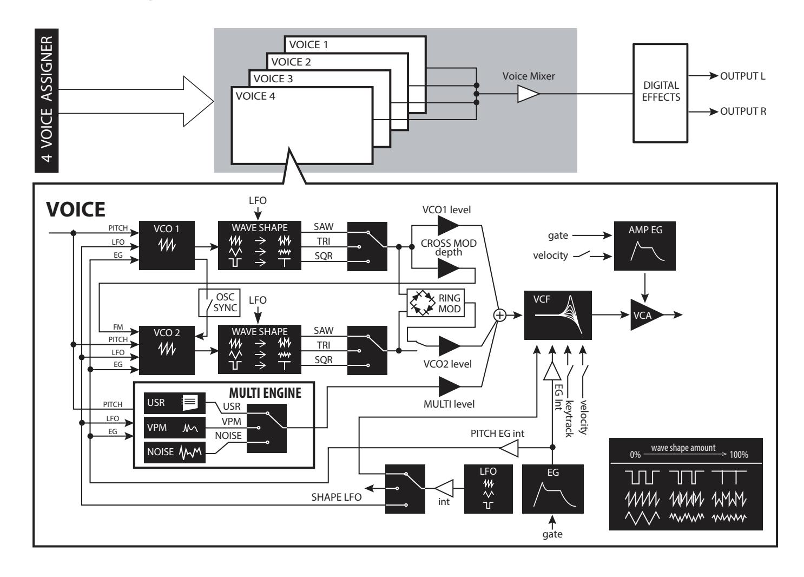

<!-- AI Image Description: _page_3_Figure_1.jpeg -->
> **[Image: _page_3_Figure_1.jpeg]** Signal flow block diagram for the Korg Minilogue XD, divided into two main sections. The upper section is labeled '4 VOICE ASSIGNER' and shows how four voices (VOICE 1 through VOICE 4) are routed into a Voice Mixer block, which then feeds into a DIGITAL EFFECTS block, and finally outputs to OUTPUT L and OUTPUT R (stereo output). The lower section is labeled 'VOICE' and shows the detailed internal signal flow of a single voice. The signal path begins with three sound sources: VCO 1 (with WAVE SHAPE and a sawtooth/pulse waveform icon), VCO 2 (with WAVE SHAPE and similar waveform icons, receiving CROSS MOD input), and MULTI ENGINE (with multiple waveform icons including noise). VCO 1 has a SYNC connection to VCO 2. Each oscillator has its own level control (VCO1 level, VCO2 level, MULTI level) feeding into a VOICE MIXER. A 'velocity' input also goes to the mixer. The mixed signal passes through a 2-POLE FILTER (low-pass filter, shown with a filter curve icon), then to a VCA (voltage-controlled amplifier) controlled by an AMP EG (amplitude envelope generator) which receives a gate signal. The output then goes through what appears to be post-filter processing including a 'user' block (likely the user-programmable digital effects slot) and a waveform display. An LFO block provides modulation and connects to multiple destinations. A PITCH EG feeds into the oscillator pitch. The SHAPE LFO is shown connecting to wave shape parameters. Various modulation routings are indicated by arrows throughout the diagram. The filter receives EG (envelope generator) modulation. Key tracking ('gate') signals are shown entering the envelope generators.

## **Controls and connections**

## **Front panel controls**

This diagram shows the layout of the front panel knobs, switches, and buttons.

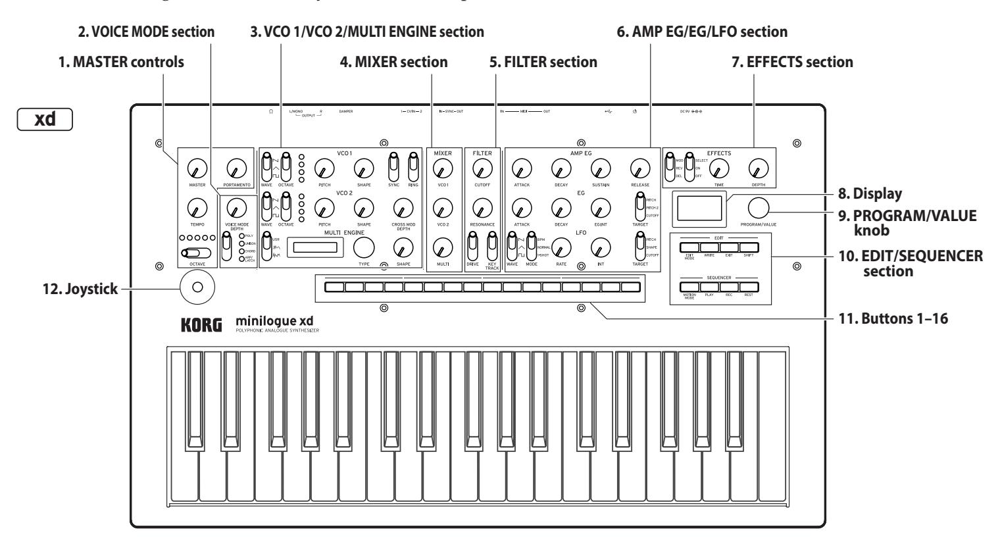

<!-- AI Image Description: _page_4_Figure_3.jpeg -->
> **[Image: _page_4_Figure_3.jpeg]** Annotated overview diagram of the Korg Minilogue XD keyboard synthesizer with numbered callouts identifying all panel sections. The numbered sections are: 1. MASTER controls (far left, includes master volume and tempo knobs), 2. VOICE MODE section (voice mode depth and related controls), 3. VCO 1/VCO 2/MULTI ENGINE section (the oscillator controls in the center-left area), 4. MIXER section (level sliders for the three sound sources), 5. FILTER section (cutoff, resonance, drive, key track), 6. AMP EG/EG/LFO section (envelope generators and low-frequency oscillator), 7. EFFECTS section (digital effects controls on the upper right), 8. Display (OLED screen showing program information), 9. PROGRAM/VALUE knob (large rotary encoder for selecting programs and editing values), 10. EDIT/SEQUENCER section (buttons for editing and sequencer control), 11. Buttons 1-16 (the row of 16 step/select buttons), 12. Joystick (pitch bend and modulation controller on the far left, above the keyboard). The 'xd' logo is visible on the left side panel. The keyboard spans the lower portion of the instrument.

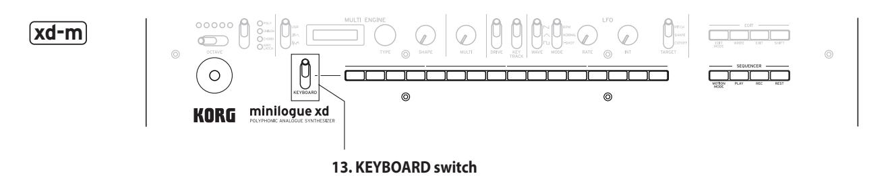

<!-- AI Image Description: _page_4_Picture_4.jpeg -->
> **[Image: _page_4_Picture_4.jpeg]** Annotated diagram showing the bottom/lower portion of the Korg Minilogue XD module version (xd-m, indicated by the 'xd-m' logo on the left end panel). This shows the controls that are specific to or more visible on the module version. The main callout is labeled '13. KEYBOARD switch' pointing to a toggle switch located below the MULTI ENGINE section. The visible controls from left to right include: OCTAVE selector (with four LEDs and up/down buttons), a joystick, the KEYBOARD switch, MULTI ENGINE section (TYPE selector with three slider positions, SHAPE knob, MULTI knob), DRIVE knob, KEY TRACK slider, WAVE slider, MODE three-position switch (BPM/NORMAL/1-SHOT), RATE knob, INT knob, TARGET selector, and on the far right the EDIT section (EDIT MODE, WRITE, EXIT, SHIFT buttons) and SEQUENCER section (MOTION MODE, PLAY, REC, REST buttons). A row of 16 touch-sensitive buttons (slim rectangular pads) replaces the keyboard for note input on this module version.

#### **1. MASTER controls**

MASTER knob OCTAVE switch [\(p.10\)](#page-9-1) TEMPO knob [\(p.17\)](#page-16-1) PORTAMENTO knob [\(p.17\)](#page-16-2)

**2. VOICE MODE section** [\(p.17\)](#page-16-3)

VOICE MODE DEPTH knob VOICE MODE TYPE switch

#### **3. VCO 1/VCO 2/MULTI ENGINE section**

**VCO 1** [\(p.18\)](#page-17-1) WAVE switch OCTAVE switch PITCH knob SHAPE knob

**VCO 2** [\(p.18\)](#page-17-1)

WAVE switch

OCTAVE switch

PITCH knob

SHAPE knob

SYNC switch

RING switch

CROSS MOD DEPTH knob

**MULTI ENGINE** [\(p.19\)](#page-18-0)

NOISE/VPM/USR switch

Display

TYPE knob

SHAPE knob

#### **4. MIXER section** [\(p.22\)](#page-21-1)

VCO 1 knob

VCO 2 knob

MULTI knob

#### **5. FILTER section** [\(p.23\)](#page-22-1)

**VCF**

CUTOFF knob

RESONANCE knob

DRIVE switch

KEYTRACK switch

#### **6. AMP EG/EG/LFO section**

**AMP EG** [\(p.24\)](#page-23-1)

ATTACK knob

DECAY knob

SUSTAIN knob

RELEASE knob

**EG** [\(p.24\)](#page-23-2)

ATTACK knob

DECAY knob

EG INT knob

TARGET switch

**LFO** [\(p.25\)](#page-24-0)

WAVE switch

MODE switch

RATE knob

INT knob

TARGET switch

#### **7. EFFECTS section** [\(p.26\)](#page-25-1)

DEL/REV/MOD switch

OFF/ON/SELECT switch

TIME knob

DEPTH knob

#### **8. Display** [\(p.10\)](#page-9-1) [\(p.47\)](#page-46-0)

#### **9. PROGRAM/VALUE knob** [\(p.10\)](#page-9-1) [\(p.33\)](#page-32-1)

#### **10.EDIT/SEQUENCER section**

**EDIT** [\(p.33\)](#page-32-1)

EDIT MODE button

WRITE button

EXIT button

SHIFT button

**SEQUENCER** [\(p.27\)](#page-26-1)

MOTION MODE button

PLAY button

REC button

REST button

#### **11.Buttons 1–16** [\(p.11\)](#page-10-1) [\(p.12\)](#page-11-1) [\(p.13\)](#page-12-1)

[\(p.27\)](#page-26-2) [\(p.31\)](#page-30-0) [\(p.33\)](#page-32-1)

**12.Joystick** [\(p.10\)](#page-9-1)

**13. xd-m KEYBOARD switch** [\(p.10\)](#page-9-1)

## **Rear panel connections**

The illustration below shows a typical example of connections for the minilogue xd. Connect the minilogue xd as appropriate for your own sound system.

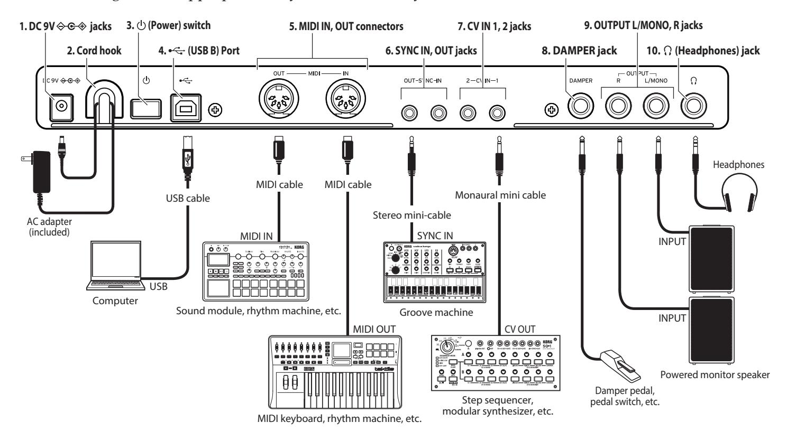

<!-- AI Image Description: _page_6_Figure_2.jpeg -->
> **[Image: _page_6_Figure_2.jpeg]** Rear panel connection diagram of the Korg Minilogue XD showing all input/output jacks with numbered labels and illustrations of compatible equipment connected via cables. From left to right, the connections are: 1. DC 9V jack (for AC adapter power input, shown connected to an AC adapter), 2. Cord hook (for securing the power cable), 3. Power switch (on/off toggle), 4. USB B port (shown connected via USB cable to a computer), 5. MIDI IN, MIDI OUT connectors (5-pin DIN, shown connected to a sound module/rhythm machine and to a MIDI keyboard/rhythm machine), 6. SYNC IN, SYNC OUT jacks (3.5mm mini-jack, shown connected to a step sequencer and groove machine via stereo mini cables), 7. CV IN 1, 2 jacks (control voltage inputs, shown with a monaural mini cable connection), 8. Not explicitly labeled in this area, 9. OUTPUT L/MONO, OUTPUT R jacks (1/4-inch audio output jacks, shown connected to a powered monitor speaker), DAMPER jack (1/4-inch jack for sustain pedal, shown connected to a damper pedal/foot switch), 10. Headphones jack (1/4-inch stereo headphone output, shown connected to headphones). Each connection point shows the type of cable needed and an illustration of a typical device that would be connected.

#### 1. DC 9V jack (p.8)

Connect the DC plug of the included AC adapter to this jack.

#### **2. xd** Cable hook (p.8)

Loop the DC plug end of the AC adapter cable around this hook to prevent the cable from being accidentally pulled out.

#### **3.** Power switch (p.8)

Use this switch to turn the minilogue xd on or off.

#### **4.** USB B port (p.57)

This port allows the minilogue xd to exchange MIDI messages with your computer.

#### **5.** MIDI IN, OUT connectors (p.56)

Connect these to an external MIDI device so that MIDI data can be transmitted and received.

#### 6. SYNC IN, OUT jacks (p.55)

Connect these jacks to the SYNC IN, OUT jacks on the Korg volca series, to synchronize with the pulses and steps that are outputted. The SYNC OUT jack outputs a 5 V pulse, 15 ms long at the beginning of each step. Use a stereo mini cable for this connection.

#### **7.** CV IN 1, 2 jacks (p.56)

Connect these jacks to a device that can output CV signals to control the parameters of the minilogue xd. The voltage range is from –5 V to +5 V. Use a monaural mini cable (or a stereo mini cable).

#### 8. DAMPER jack

Connect a Korg DS-1H damper pedal (sold separately) or a PS-1/PS-3 pedal switch (sold separately) to control the damper function.

The minilogue xd does not feature a half-damper function.

#### **9.** OUTPUT L/MONO, R jacks (p.8)

Connect these jacks to a powered monitor speaker or similar device. Adjust the volume level using the MASTER knob. To output monaural sound, use the OUTPUT L/MONO jack.

#### 10. Headphones jack (p.8)

Connect your headphones to this jack. This jack outputs the same signal as that of the OUTPUT jack.

#### **Connecting the AC adapter**

- *1.* **Connect the DC plug of the included AC adapter to the DC 9V jack located on the rear panel of the minilogue xd.**
  - Be sure to use only the included AC adapter. Using any other AC adapter may cause malfunctions.
  - **xd Hook the AC adapter cord onto the cord hook.**
  - Do not use excessive force when pulling the cord off the hook. Doing so may damage the plug.
- *2.* **Connect the plug of the AC adapter to an AC outlet.**
  - Be sure to use an AC outlet of the correct voltage for your AC adapter.

#### **Connecting audio devices**

- Be sure that all of your devices are turned off when making connections. Making connections with the power still turned on may damage the device or speaker.
- *•* **Connect the OUTPUT L/MONO, R jacks on the minilogue xd to your powered monitor speaker, mixer or other audio device.**
  - To **output monaural sound**, use the OUTPUT L/MONO jack.
- *•* **To use headphones, connect the plug on your headphones to the headphones jack.**
  - Tip: Adjust the volume levels for the OUTPUT jacks and headphones jack using the MASTER knob.

#### **Connecting the minilogue xd to a computer or other MIDI devices**

You can connect the minilogue xd to a computer or other MIDI device via USB or MIDI to send and receive note data. Refer to ["Using with other devices" \(p.55\)](#page-54-2) for details.

You can also poly-chain this instrument to another minilogue xd. Refer to ["Poly Chain" \(p.46\)](#page-45-0) and ["Poly-chain" \(p.51\)](#page-50-1) for details.

## **Turning the power on/off**

## **Turning the minilogue xd on**

Make sure that both the minilogue xd and any external output devices such as powered monitor speakers are turned off, and turn the volume of all devices all the way down.

- *1.* **Hold down the Power switch on the rear panel of the minilogue xd; once the "minilogue xd" logo appears in the display, take your finger off the Power switch.** The word "Tuning..." will appear on the display, and the instrument will enter Tuning mode
  - for the analog synthesizer circuit, for around 15 seconds. After this, the minilogue xd will enter to Play mode.
- *2.* **Turn on any external output devices such as powered monitor speakers.**
- *3.* **Adjust the volume of your external output equipment, and adjust the minilogue xd's volume using the MASTER knob.**

#### **Turning the minilogue xd off**

Any program data in the minilogue xd that has not been saved will be lost when the power is turned off. Be sure to save any programs and other important data that you have edited [\(p.16](#page-15-1)  ["Saving a program"\).](#page-15-1)

- *1.* **Lower the volume of your powered monitors or external output system, and turn them off.**
- *2.* **Hold down the Power switch on the rear panel of the minilogue xd; to turn off the power after the display goes blank, take your finger off the power switch.**
  - After turning the minilogue xd off, wait about 10 seconds before turning it on again.

#### **Auto power off feature**

By default, the minilogue xd will automatically turn off after about 20 minutes have elapsed without use of the front panel, keyboard, or MIDI input.

The Auto Power Off can be disabled using the steps below.

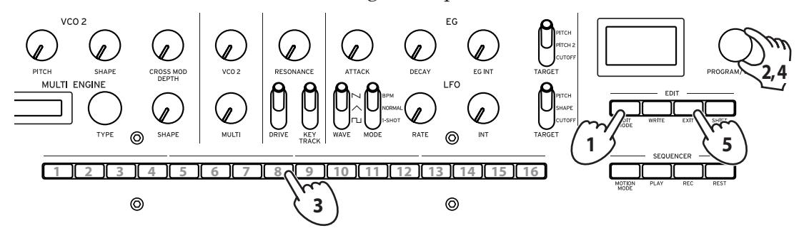

<!-- AI Image Description: _page_8_Picture_8.jpeg -->
> **[Image: _page_8_Picture_8.jpeg]** Instructional diagram showing a portion of the Korg Minilogue XD front panel with numbered hand gestures indicating a sequence of operations for editing or programming. The visible sections include: VCO 2 (PITCH, SHAPE knobs), MULTI ENGINE (TYPE, SHAPE controls), CROSS MOD DEPTH knob, VCO 2 level slider, RESONANCE knob, EG section (ATTACK, DECAY knobs, EG INT knob), LFO section, TARGET selectors (showing PITCH, PITCH 2, CUTOFF options for EG TARGET and PITCH, SHAPE, CUTOFF options for LFO TARGET), the OLED display, and the PROGRAM/VALUE knob. Five numbered hand gestures are shown: '1' points to the TARGET selector area (EG or LFO target), '2' and '4' show a hand turning the PROGRAM/VALUE knob, '3' shows a finger pressing one of the step buttons (button 9 area), and '5' shows a hand pressing the SHIFT button in the EDIT section. The 16 step buttons are visible along the bottom. This appears to be illustrating a multi-step workflow for selecting targets, adjusting values, selecting steps, and using shift functions.

#### *1.* **Press the EDIT MODE button.**

The minilogue xd will enter Edit mode, and the display will look like the illustration shown below.

<!-- AI Image Description: _page_8_Picture_11.jpeg -->
> **[Image: _page_8_Picture_11.jpeg]** Close-up of the Korg Minilogue XD OLED display showing an edit mode menu. The display shows three menu options stacked vertically: 'PROGRAM EDIT' (highlighted/selected at the top), 'SEQ EDIT' (middle), and 'GLOBAL EDIT' (bottom). This represents the top-level edit mode menu that appears when the EDIT MODE button is pressed, allowing the user to choose between editing program parameters, sequencer settings, or global system settings.

#### *2.* **Turn the PROGRAM/VALUE knob, and select "GLOBAL EDIT."**

The minilogue xd will enter GLOBAL Edit mode.

Tip: GLOBAL EDIT can also be selected by pressing the EDIT MODE button.

#### *3.* **Press button 8 three times.**

"Auto Power Off" will be displayed.

#### *4.* **Turn the PROGRAM/VALUE knob, and select "Off".**

#### *5.* **Press the EXIT button.**

The minilogue xd will enter Play mode, and the display will indicate the current program.

## **Playing the minilogue xd**

## **Selecting and playing a program**

The minilogue xd features 500 program memories. When the unit is shipped from the factory, preset programs are assigned to program numbers 1–200. Programs 201–500 contain init programs (programs that have been initialized).

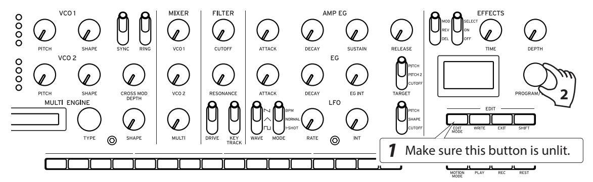

<!-- AI Image Description: _page_9_Picture_3.jpeg -->
> **[Image: _page_9_Picture_3.jpeg]** Instructional diagram showing the right-hand portion of the Korg Minilogue XD front panel, focused on demonstrating a sound editing workflow. Visible sections from left to right: VCO 1 (PITCH, SHAPE knobs, SYNC switch, RING label), MIXER (VCO 1 slider), FILTER (CUTOFF knob, ATTACK, DECAY, SUSTAIN sliders), AMP EG (RELEASE slider), EG section (ATTACK, DECAY knobs, EG INT knob), EFFECTS section (SELECT knob with MOD/REV/DEL/OFF positions, TIME knob, DEPTH knob), TARGET selector, OLED display, and PROGRAM/VALUE knob. Two numbered hand gestures are shown: '1' indicates ensuring the EDIT MODE button is unlit (i.e., not in edit mode, meaning the panel controls directly affect sound parameters), and '2' shows a hand turning the PROGRAM/VALUE knob to select a program. The LFO section is partially visible with WAVE, MODE (BPM/NORMAL/1-SHOT), RATE, and INT controls. The EDIT section buttons (EDIT MODE, WRITE, EXIT, SHIFT) and SEQUENCER section (MOTION MODE, PLAY, REC, REST) are visible at bottom right. This diagram instructs the user to first make sure they are NOT in edit mode, then use the knobs and sliders to directly tweak the sound.

*1.* **Check that the minilogue xd is in Play mode.**

In Play mode, verify that the EDIT MODE button on the front panel is unlit. If the EDIT MODE button is lit, press the EXIT button.

*2.* **Turn the PROGRAM/VALUE knob to select a program.**

The display will indicate the program name. For details, refer to ["Program list" \(p.61\)](#page-60-1).

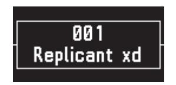

<!-- AI Image Description: _page_9_Picture_8.jpeg -->
> **[Image: _page_9_Picture_8.jpeg]** Close-up of the Korg Minilogue XD OLED display showing a program selection screen. The display reads '001' on the top line (the program number) and 'Replicant xd' on the bottom line (the program name). This is the default/normal operating view where the currently loaded program number and name are displayed. Program 001 named 'Replicant xd' appears to be the first factory preset.

Tip: In addition to showing the program name, the display can also be used as an **oscilloscope** to show the waveform created by the electrical signals of the sound.

*3.* **Play the keyboard and try using the joystick and OCTAVE switch and other controls on the front panel.**

You can use the **OCTAVE switch** to transpose the playing area of the keyboard by ±2 octaves.

The **joystick** mainly controls the pitch when moved from left to right, and changes parameters such as the cutoff frequency and vibrato depth when moved up and down. You can also change which parameters are controlled by the joystick. See ["Button 4 \(JOYSTICK\)" \(p.35\)](#page-34-1) for details.

Use the **VOICE MODE TYPE switch** to switch between voice modes. Select a voice mode and play. To learn more about voice modes, see ["VOICE MODE section" \(p.17\)](#page-16-3).

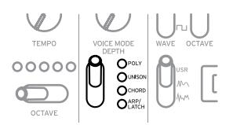

<!-- AI Image Description: _page_9_Picture_14.jpeg -->
> **[Image: _page_9_Picture_14.jpeg]** Close-up illustration of three control groups from the Korg Minilogue XD front panel, shown in a slightly grayed-out or instructional style. From left to right: (1) TEMPO knob - a vertical slider-style control for setting the tempo/BPM. (2) VOICE MODE DEPTH knob - a rotary knob with a detent center, accompanied by four LEDs and labels below showing the voice mode options: POLY (polyphonic), UNISON, CHORD, and ARP/LATCH (arpeggiator/latch mode). These modes are selectable, likely by pressing a button that cycles through them, with the corresponding LED illuminating. (3) WAVE and OCTAVE controls - the WAVE control appears to be a vertical slider or selector for choosing the oscillator waveform, and the OCTAVE control is a rotary knob. A 'USR' (user) label is visible near the WAVE control, indicating a user-definable waveform option. These controls likely belong to one of the VCO sections (VCO 1 or VCO 2).

## **xd-m Playing in Keyboard mode**

You can use the keyboard of an external device that is connected to the minilogue xd module via the MIDI IN connector or USB B port, or you can turn the Keyboard mode of the minilogue xd module on to play using buttons 1–16. Buttons 1–16 can be used for both step and real-time recording.

*1.* **Flip the KEYBOARD switch up to turn Keyboard mode on.**

A keyboard icon " " will be shown in the upper-right part of the display.

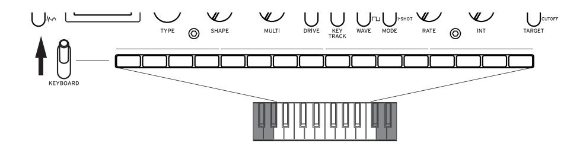

<!-- AI Image Description: _page_10_Picture_4.jpeg -->
> **[Image: _page_10_Picture_4.jpeg]** A diagram showing the lower portion of the Korg Minilogue XD front panel, focusing on the Multi Engine row, the step sequencer button strip, and the keyboard. From left to right along the top row of controls: a waveform icon and the KEYBOARD label with an upward arrow and a joystick/pitch-bend lever illustration; then a row of knobs and switches labeled TYPE (with a small selector button), SHAPE (large knob), MULTI (large knob), DRIVE (large knob), KEY TRACK (toggle switch with a square-wave icon), WAVE (toggle switch with waveform icons), MODE (toggle switch labeled 1-SHOT), RATE (large knob), INT (small knob with LED indicator), and TARGET/CUTOFF (large knob). Below these controls is a horizontal strip of 16 step-sequencer buttons (rectangular, evenly spaced). Below the step buttons is a depiction of the 37-note keyboard (approximately 2 octaves visible), showing both white and black keys. This section represents the Multi Engine oscillator controls and the LFO controls integrated into the same panel row, along with the sequencer interface and the physical keyboard.

*2.* **Play using buttons 1–16.** Buttons 1–16 will light to indicate the black and white keys.

*3.* **After you've finished playing the buttons, flip the KEYBOARD switch down to turn Keyboard mode off.**

#### **Buttons 1–16**

When the keyboard mode is set to OFF on the minilogue xd module, buttons 1–16 will operate as follows.

- Favorite programs: Recall, register
- Edit Mode: Select Edit page
- When the sequencer is playing: Step display
- Step recording: Change the step gate time, select step
- Step edit: Enable/disable step, input notes and motion sequences

Note: These operations are unavailable when the keyboard mode is ON. Use the KEYBOARD switch to switch between keyboard modes as necessary.

## **Using Favorites**

You can use the **favorites** to register up to 16 programs that you like, to easily call them back later. Using the "Shift Function" in GLOBAL EDIT mode, begin by selecting "Favorite" (the "Favorite" is already configured by factory default). Refer to ["Shift Function" \(p.47\)](#page-46-1) for details.

#### **Recalling your favorite programs**

*1.* **In Play mode, press one of the buttons from 1–16 while holding down the SHIFT button.** The favorite program previously registered to that button will be recalled, and the program name will be shown in the display.

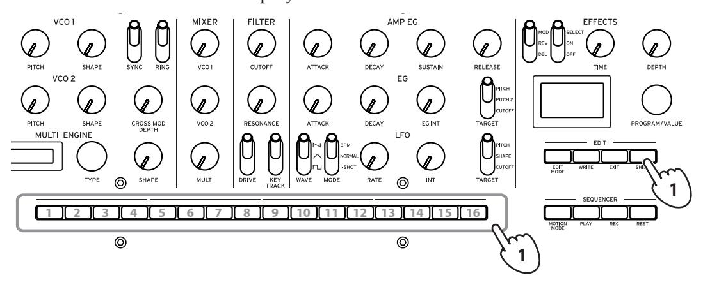

<!-- AI Image Description: _page_11_Picture_4.jpeg -->
> **[Image: _page_11_Picture_4.jpeg]** A diagram of the full Korg Minilogue XD top panel (right-hand control surface) illustrating a step-by-step instruction where a finger icon labeled '1' is pressing the PROGRAM/VALUE encoder on the right side of the panel. The panel layout from left to right shows: VCO 1 section (PITCH and SHAPE knobs, SYNC and RING toggle switches), VCO 2 section (PITCH and SHAPE knobs, CROSS MOD DEPTH knob), MULTI ENGINE section (TYPE selector, SHAPE knob, MULTI knob, DRIVE knob, KEY TRACK switch), MIXER section (VCO 1 and VCO 2 level knobs), FILTER section (CUTOFF and RESONANCE knobs), AMP EG section (ATTACK, DECAY, SUSTAIN, RELEASE knobs), EG section (ATTACK, DECAY, EG INT knobs, TARGET 3-position switch for PITCH/PITCH 2/CUTOFF), LFO section (WAVE switch, MODE switch with BPM/NORMAL/1-SHOT, RATE knob, INT knob with LED, TARGET 3-position switch for PITCH/SHAPE/CUTOFF), EFFECTS section (MOD/REV/DEL selector, ON/OFF switch, SELECT button, TIME and DEPTH knobs), an OLED display screen, the PROGRAM/VALUE rotary encoder (being pressed by the finger icon '1'), four EDIT buttons (EDIT MODE, WRITE, EXIT, SHIFT), and a SEQUENCER section (MOTION MODE, PLAY, REC, REST buttons). Below the knobs is the 16-step sequencer button strip numbered 1-16.

#### **Registering your favorite programs**

*1.* **In Play mode, turn the PROGRAM/VALUE knob to select the program you like.** The display will indicate the program name.

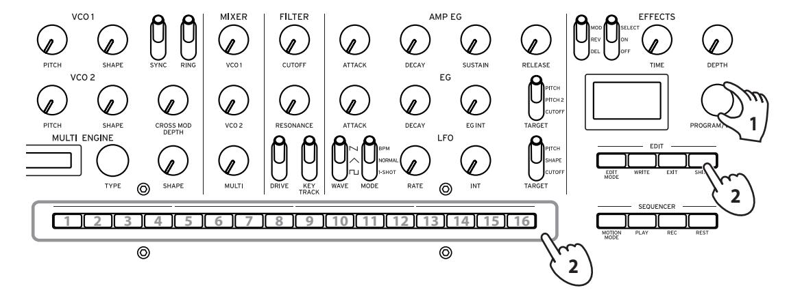

<!-- AI Image Description: _page_11_Figure_7.jpeg -->
> **[Image: _page_11_Figure_7.jpeg]** A diagram of the full Korg Minilogue XD top panel, nearly identical to the previous image but showing a two-step instruction. A finger icon labeled '2' is pressing the PROGRAM/VALUE encoder on the right side, and another finger icon labeled '2' is shown pressing the PLAY button in the SEQUENCER section at the bottom right. The panel layout is the same as described above: VCO 1, VCO 2, MULTI ENGINE, MIXER, FILTER, AMP EG, EG, LFO sections with all their respective knobs and switches, the EFFECTS section, OLED display, PROGRAM/VALUE encoder, EDIT buttons, and SEQUENCER buttons. This diagram appears to illustrate the second step of a procedure, where the user simultaneously or sequentially interacts with the PROGRAM/VALUE encoder and the PLAY button.

*2.* **Hold down one of the buttons from 1–16 while keeping the SHIFT button pressed.** The program will be registered as a favorite program, and "Registered to Favorite" will be shown in the display.

Tip: The favorite programs that you register will be saved in the global settings.

## **Playing the sequencer**

Each program in the minilogue xd includes sequence data. In this section, we'll play the sequence data saved as part of the preset programs.

*1.* **Turn the PROGRAM/VALUE knob to select a program.**

The display will indicate the program name.

*2.* **Press the PLAY button in the SE-QUENCER section.**

The sequence data that is recorded in the current program will begin playing. The 1–16 buttons will light up to show the current step while the sequencer is playing.

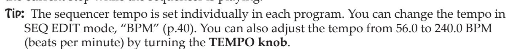

<!-- AI Image Description: _page_12_Picture_6.jpeg -->
> **[Image: _page_12_Picture_6.jpeg]** A text-based tip box from the Minilogue XD manual. It reads: 'Tip: The sequencer tempo is set individually in each program. You can change the tempo in SEQ EDIT mode, "BPM" (p.40). You can also adjust the tempo from 56.0 to 240.0 BPM (beats per minute) by turning the TEMPO knob.' This provides information about the tempo range (56.0-240.0 BPM), the fact that tempo is stored per-program, and the two methods of changing tempo: via the SEQ EDIT mode BPM parameter or via the physical TEMPO knob.

*3.* **Press the PLAY button once more to end the Sequencer playback.**

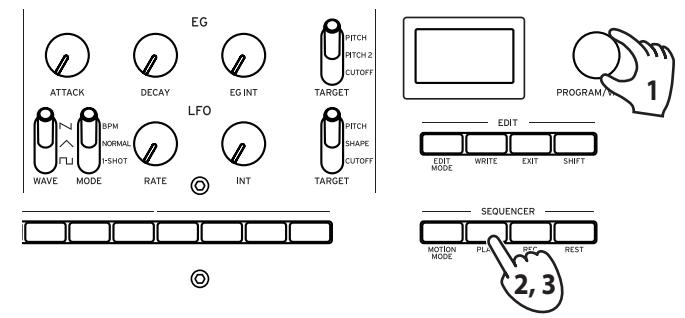

<!-- AI Image Description: _page_12_Picture_8.jpeg -->
> **[Image: _page_12_Picture_8.jpeg]** A diagram showing the right-hand portion of the Minilogue XD panel focused on the EG, LFO, and control sections, illustrating a multi-step procedure. The EG section shows ATTACK, DECAY, and EG INT knobs, plus a TARGET 3-position switch (PITCH/PITCH 2/CUTOFF). The LFO section shows WAVE switch (sawtooth, triangle, square waveform options), MODE switch (BPM/NORMAL/1-SHOT), RATE knob, INT knob with LED indicator, and TARGET 3-position switch (PITCH/SHAPE/CUTOFF). To the right is the OLED display screen and the PROGRAM/VALUE encoder (with a finger icon labeled '1' pressing it). Below are the EDIT section buttons (EDIT MODE, WRITE, EXIT, SHIFT) and the SEQUENCER section buttons (MOTION MODE, PLAY, REC, REST), with finger icons labeled '2, 3' pointing at the PLAY and REC buttons. Below the EG/LFO area is a row of step sequencer buttons and a copyright symbol.

## **Programs**

## **Program architecture**

A program includes settings for sounds, voice mode and effects, as well as sequence data and so on. (MASTER knob and joystick settings are not included in programs.)

Try editing each related parameter, and enjoy the sounds of the minilogue xd.

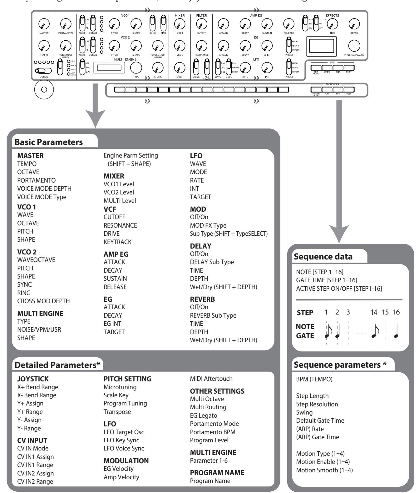

<!-- AI Image Description: _page_13_Figure_4.jpeg -->
> **[Image: _page_13_Figure_4.jpeg]** A comprehensive parameter reference chart for the Korg Minilogue XD, divided into four major sections. TOP: A small illustration of the synthesizer's top panel showing the physical layout of all controls. MIDDLE-LEFT - 'Basic Parameters': Lists all parameters organized by functional section: MASTER (Tempo, Octave, Portamento, Voice Mode Depth, Voice Mode Type), VCO 1 (Wave, Octave, Pitch, Shape/Octave), VCO 2 (Pitch, Shape, Sync, Cross Mod Depth), MULTI ENGINE (Type, Noise/VPM/User, Shape), ENGINE FARM SETTING (Shift+Shape), MIXER (VCO1 Level, VCO2 Level, Multi Level), VCF (Cutoff, Resonance, Drive, Keytrack), AMP EG (Attack, Decay, Sustain, Release), EG (Attack, Decay, EG Int, Target), LFO (Wave, Mode, Rate, Int, Target), MOD (Mod FX Type, Sub-Type via Shift+Type/Depth), DELAY (Delay Sub-Type, Time, Depth, Wet/Dry via Shift+Depth), REVERB (Reverb Sub-Type, Time, Depth, Wet/Dry via Shift+Depth). MIDDLE-RIGHT - 'Sequence data': Shows parameters for NOTE (Steps 1-16), ACTIVE STEP ON/OFF (Steps 1-16), and a visual representation of STEP, NOTE, and GATE data across steps 1-16. BOTTOM-LEFT - 'Detailed Parameters': Lists JOYSTICK settings (X+/- Bend Range, Y+ Assign/Range, Y- Assign/Range), CV INPUT settings (CV In Mode, CV In1/In2 Range), PITCH SETTING (Microtuning, Scale Key, Program Tuning, Transpose), LFO (LFO Target Osc, LFO Key Sync), MODULATION (EG Velocity, Amp Velocity), MIDI (Aftertouch), OTHER SETTINGS (Multi Octave, Multi Routing, EG Legato, Portamento BPM, Portamento Mode, Program Length). BOTTOM-RIGHT - 'Sequence parameters': Lists BPM (Tempo), Step Resolution, Swing, Gate Time, AMPT Rate, Motion Type (1-4), Motion Enable (1-4), Motion Smooth (1-4), and MULTI ENGINE (Parameter 1-6, Program Name).

\* Edit mode parameters

## **Creating sounds**

You can edit the parameters that make up a program, in order to modify the sound as you like. There are two ways to create sounds on the minilogue xd.

- You can select an existing program that's close to the sound you want, and edit that program's parameters to achieve your own custom sound.
- You can also create your own sound from scratch from an init program.

### **Editing an existing program**

- *1.* **In Program mode, select the program that you want to use as a starting point.**
- *2.* **Use the knobs and switches on the front panel.**

Take a moment to consider the differences between the current program and the sound you have in mind, and use the front panel controls to edit the necessary parameters.

Tip: For details on how the pitch, sound, and volume change when using the knobs and switches, refer to ["Basic parameters" \(p.17\)](#page-16-4).

We recommend that you save the program on the minilogue xd after editing the sound. Any edits that you make will be lost if you turn off the power or recall a different program. See ["Saving a program" \(p.16\)](#page-15-1) for details.

#### **Creating a program from scratch**

To create a program from scratch, we recommend that you use the **panel load** function. This will load the current settings of each front panel control and provide a simple starting point for your sonic creations.

As you explore the front panel controls, you can see how each parameter will affect the sound, making it easier to understand how each section of the minilogue xd functions and how the parameters interact.

You can also create programs after initializing them [\(p.40 "Initialize Program"\)](#page-39-2).

#### **Panel load function**

When the WRITE button is pressed while holding down the SHIFT button, the panel load function will be enabled. The sound will change to reflect the panel settings, and "Load Panel" will be indicated in the display.

## **Saving a program**

We recommend that you save your program on the minilogue xd after editing the sound to your liking.

Any edits that you make will be lost if you turn off the power or recall a different program before saving the program.

#### *1.* **Edit the program in Play mode.**

See ["Basic parameters" \(p.17\)](#page-16-4) for details.

*2.* **Press the WRITE button. The minilogue xd will enter write standby mode, and the WRITE button will blink.**

The display will indicate the message "Where to write?".

*3.* **Turn the PROGRAM/VALUE knob to select the program number where your new sound will be saved.**

Tip: Press the EXIT button to cancel the operation.

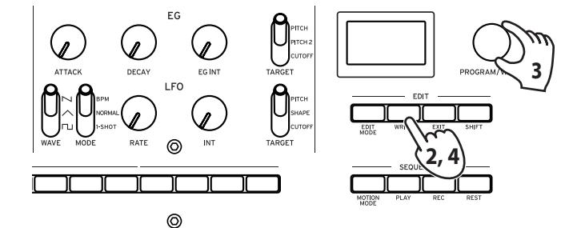

<!-- AI Image Description: _page_15_Picture_9.jpeg -->
> **[Image: _page_15_Picture_9.jpeg]** A diagram showing the right-hand portion of the Minilogue XD panel, illustrating a multi-step procedure for editing or writing operations. The EG section displays ATTACK, DECAY, and EG INT knobs, plus the TARGET 3-position switch (PITCH/PITCH 2/CUTOFF). The LFO section displays WAVE switch, MODE switch (BPM/NORMAL/1-SHOT), RATE knob, INT knob with LED, and TARGET switch (PITCH/SHAPE/CUTOFF). To the right: the OLED display screen and the PROGRAM/VALUE encoder with a finger icon labeled '3' pressing/turning it. Below: the EDIT section with four buttons (EDIT MODE, WRITE, EXIT, SHIFT), where finger icons labeled '2, 4' point to the WRITE and EXIT buttons. The SEQUENCER section (MOTION MODE, PLAY, REC, REST) is shown below. A row of step buttons and a copyright symbol appear at the bottom. This diagram illustrates steps 2, 3, and 4 of some editing procedure -- likely: step 2 press WRITE, step 3 turn PROGRAM/VALUE to confirm, step 4 press EXIT.

#### *4.* **Press the WRITE button once more.**

The display will indicate the message "Complete".

Never turn off the power while programs are being saved. Doing so may destroy the internal data.

## **Basic parameters**

In this section, we'll explain the basic parameters that make up a program.

The basic parameters are assigned to the knobs and switches on the front panel.

## **MASTER controls**

To learn more about the OCTAVE button, see ["Selecting and playing a program" \(p.10\)](#page-9-1).

#### **TEMPO knob [BPM 56.0...240.0]**

Use this parameter to adjust the tempo of the sequencer for each program in beats per minute (BPM). When the voice mode is "ARP", the value set here is also used for the arpeggiator tempo.

#### **PORTAMENTO knob [0...127]**

This parameter controls the portamento time.

The further the knob is turned to the right, the longer the portamento time will be.

### **VOICE MODE section**

The minilogue xd features four analog synthesizer voices. By changing the Voice mode, you can combine and allocate the voices in different ways.

There are four voice modes. Use the VOICE MODE TYPE switch to select a voice mode.

Turning the VOICE MODE DEPTH knob adds different effects for each Voice mode.

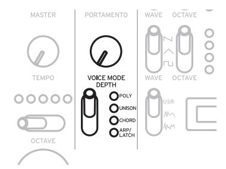

<!-- AI Image Description: _page_16_Picture_14.jpeg -->
> **[Image: _page_16_Picture_14.jpeg]** A diagram showing the MASTER and voice configuration section of the Minilogue XD front panel. From left to right: The MASTER section contains a TEMPO knob (large rotary encoder) and an OCTAVE up/down button pair below it. To the right is the PORTAMENTO section with a large VOICE MODE DEPTH knob at the center. Below the VOICE MODE DEPTH knob is a vertical toggle switch or selector for VOICE MODE TYPE with four positions indicated by LEDs: POLY, UNISON, CHORD, and ARP/LATCH (from top to bottom). Further to the right (shown grayed out/faded) are the WAVE and OCTAVE controls for VCO 1, including a waveform selector switch and octave selector with multiple LED positions, plus a 'USR' (user) option. This image highlights the master tempo, octave transposition, portamento depth, and voice mode selection controls.

#### **Voice mode list**

| Type   | Action                                                                                      | VOICE MODE DEPTH knob effect                                                                                                                                                                                                              |
|--------|---------------------------------------------------------------------------------------------|-------------------------------------------------------------------------------------------------------------------------------------------------------------------------------------------------------------------------------------------|
| POLY   | Used for basic playing as a 4-voice polyphonic synth.                                    | [POLY, DUO 01023] Turn the knob to the right to switch to DUO mode, which stacks two voices when play ing a key. Turning the knob to the right will increase the sound of the stacked voice, and deepen the detune effect. |
| UNISON | The 4 voices will be stacked together into a single voice in unison, as a mono synth. | [Detune 0C50C] Turning the knob to the right will increase the detuning effect.                                                                                                                                                     |
| CHORD  | The voices will play as a chord.                                                            | [Mono, 5th, sus2, m, Maj, sus4, m7, 7, 7sus4, Maj7, aug, dim, m7♭ 5, mMaj7, Maj7♭ 5] Selects either mono or the chord type.                                                                                                   |

| Type      | Action                                                                                                                                                                                                                                        | VOICE MODE DEPTH knob effect                                                                                                                                                                                                                                                                                                                                                                                                                                                                                    |
|-----------|-----------------------------------------------------------------------------------------------------------------------------------------------------------------------------------------------------------------------------------------------|-----------------------------------------------------------------------------------------------------------------------------------------------------------------------------------------------------------------------------------------------------------------------------------------------------------------------------------------------------------------------------------------------------------------------------------------------------------------------------------------------------------------|
| ARP/LATCH | Uses the arpeggiator to play up to 4 voices. Switches between LATCH ON and OFF. Set the arpeggiator tempo, swing and gate time using the "TEMPO knob" (p.17), "Swing" (p.41) and "Default Gate Time" (p.41) settings. | [MANUAL 1, MANUAL 2, RISE 1, RISE 2, FALL 1, FALL 2, RISE FALL 1, RISE FALL 2, POLY 1, POLY 2, RANDOM 1, RANDOM 2, RANDOM 3] Selects the arpeggiator type. If you set the VOICE MODE TYPE switch to ARP/LATCH and then move the switch down, the latch will be turned on (the LED will blink), and the arpeggiator will keep playing even after you take your hands off the keyboard. If you move the switch up while latched, the switch will latch off (the LED will light). |

## **VCO 1/VCO 2/MULTI ENGINE section**

#### **VCO 1, VCO 2** VCO: Voltage Controlled Oscillator

There are two oscillators in the minilogue xd. Here, we will adjust the basic settings for the sound, including pitch (OC-TAVE, PITCH), waveform (WAVE, SHAPE) and so on.

### **WAVE switch [SQR , TRI , SAW ]**

This sets the waveforms for oscillators 1 and 2.

**SQR (square wave)**: This waveform is used for electronic and wind instrument sounds.

**TRI (triangle wave)**: This waveform has a rounder feel than the sawtooth or square wave.

**SAW (sawtooth wave)**: This waveform is used to create sounds typical of analog synthesizers, such as synth basses and synth brass.

### **OCTAVE switch [16', 8', 4', 2']**

The pitch of oscillators 1 and 2 can be set in octave steps.

#### **PITCH knob [–1200...+1200]**

The pitch, or tuning, of oscillators 1 and 2 can be set in one-cent steps.

#### **SHAPE knob [0...1023]**

This knob will determine the final shape, complexity, or duty-cycle (square) of the selected waveform for oscillators 1 and 2.

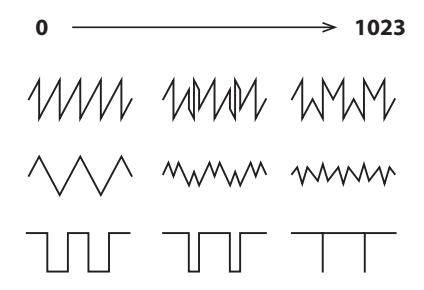

<!-- AI Image Description: _page_17_Picture_15.jpeg -->
> **[Image: _page_17_Picture_15.jpeg]** A waveform shape reference diagram for the Minilogue XD VCO SHAPE parameter. The diagram shows a horizontal axis labeled from 0 to 1023 (representing the full range of the SHAPE knob), with three rows of waveform illustrations showing how each of the three basic waveforms morphs across the SHAPE range. TOP ROW (Sawtooth): At value 0, the sawtooth wave is a standard saw shape; in the middle range it becomes a more complex/harmonically rich variant; at value 1023 it transforms into a different sawtooth variation with altered harmonic content. MIDDLE ROW (Triangle): At value 0, the triangle wave has a standard triangular shape with larger amplitude; in the middle it becomes a higher-frequency, more compressed triangle; at value 1023 it becomes an even more compressed, almost sine-like waveform with additional harmonic content. BOTTOM ROW (Square/Pulse): At value 0, the pulse wave has a roughly 50% duty cycle (standard square); in the middle the pulse width narrows; at value 1023 the pulse width is very narrow, approaching a thin pulse. This diagram visually demonstrates the continuous wave-shaping capability of each VCO waveform type as the SHAPE parameter is swept from 0 to 1023.

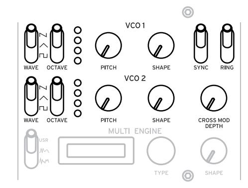

<!-- AI Image Description: _page_17_Picture_16.jpeg -->
> **[Image: _page_17_Picture_16.jpeg]** A detailed diagram of the VCO 1, VCO 2, and Multi Engine sections of the Minilogue XD front panel shown on a dark/black background. VCO 1 section (top): WAVE switch (with sawtooth, triangle, and square waveform icons), OCTAVE selector (with multiple LED positions), PITCH knob (large), SHAPE knob (large), SYNC toggle switch, and RING toggle switch. VCO 2 section (middle): WAVE switch (identical waveform options), OCTAVE selector, PITCH knob (large), SHAPE knob (large), and CROSS MOD DEPTH knob. MULTI ENGINE section (bottom, partially visible): Shows a USR (user) waveform selector with a small waveform icon, a rectangular display/selector window for TYPE, a large TYPE knob, and a SHAPE knob with a small button/LED. This image provides a clear view of all oscillator controls including waveform selection, octave range, pitch tuning, waveshaping, oscillator sync, ring modulation, and cross modulation depth parameters.

#### **SYNC switch [OFF/ON]**

This switch lets you sync the oscillators.

Oscillator sync is a popular effect for creating edgy synth leads.

**ON** (up position): With this type of modulation, the phase of oscillator 2 is forcibly synchronized to the phase of oscillator 1. This adds harmonic overtones to the frequency of oscillator 2, making a complex waveform.

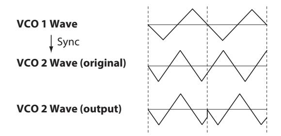

<!-- AI Image Description: _page_18_Figure_4.jpeg -->
> **[Image: _page_18_Figure_4.jpeg]** A signal flow diagram illustrating oscillator sync between VCO 1 and VCO 2 on the Minilogue XD. The diagram shows three waveforms stacked vertically with labels. TOP: 'VCO 1 Wave' -- displays a square/pulse wave at a specific frequency, with vertical dashed lines marking each cycle boundary. An arrow labeled 'Sync' points downward from VCO 1 to VCO 2. MIDDLE: 'VCO 2 Wave (original)' -- displays a triangle wave at a higher frequency than VCO 1, showing what VCO 2's waveform would look like without sync applied. BOTTOM: 'VCO 2 Wave (output)' -- displays the resulting synced waveform, where VCO 2's triangle wave is forced to restart its cycle at each VCO 1 cycle boundary (indicated by the dashed vertical lines). The output waveform shows the characteristic hard-sync sound: VCO 2's waveform is truncated and restarted at VCO 1's frequency, creating harmonically rich timbres. The dashed vertical lines align across all three waveforms to show the sync reset points.

#### **RING switch [OFF/ON]**

This lets you achieve a ring modulation effect.

Adjust the pitch of oscillator 2 to create non-tonal and metallic sounds.

**ON** (up position): Oscillator 1 is used to ring modulate oscillator 2.

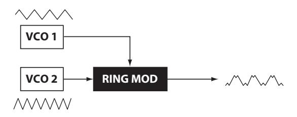

<!-- AI Image Description: _page_18_Picture_9.jpeg -->
> **[Image: _page_18_Picture_9.jpeg]** A signal flow block diagram illustrating ring modulation on the Minilogue XD. On the left side, VCO 1 is shown in a box with a sawtooth-like waveform icon above it. VCO 1 has two output paths: one going rightward into a 'RING MOD' processing block (shown as a filled/dark rectangle), and another path going directly to the right (bypassing the ring mod block and continuing to the output). VCO 2 is shown below VCO 1 in its own box with a higher-frequency sawtooth/triangle waveform icon below it. VCO 2's output feeds into the RING MOD block. The RING MOD block's output goes to the right, producing a complex waveform (shown as an irregular, harmonically rich waveform icon). This diagram demonstrates that ring modulation multiplies the VCO 1 and VCO 2 signals together, producing sum and difference frequencies, while VCO 1 also passes through unprocessed. The resulting output contains both the original VCO 1 signal and the ring-modulated signal.

#### **CROSS MOD DEPTH knob [0...1023]**

Cross Mod (Modulation) allows oscillator 1 to modulate the pitch of oscillator 2. Turning the knob to the right results in stronger modulation.

#### **MULTI ENGINE**

The MULTI ENGINE is a digital sound generation engine.

This engine operates as a noise generator, a VPM oscillator or a user oscillator, to make a wide range of sounds not possible with analog oscillators. You can load your own oscillator programs into the user oscillator to make sounds.

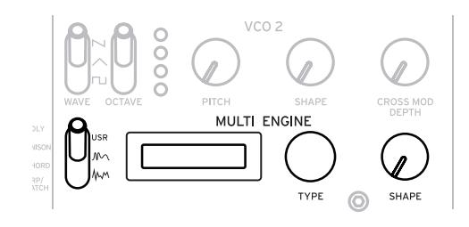

<!-- AI Image Description: _page_18_Picture_15.jpeg -->
> **[Image: _page_18_Picture_15.jpeg]** A diagram showing the VCO 2 and Multi Engine sections of the Minilogue XD panel, with some surrounding controls shown grayed out for context. The VCO 2 section displays: WAVE switch (with sawtooth, triangle, square waveform icons), OCTAVE selector, PITCH knob (large), SHAPE knob (large), and CROSS MOD DEPTH knob (highlighted/in focus on the right). Below VCO 2 is the MULTI ENGINE section showing: a USR (user) waveform selector icon, a rectangular TYPE display/selector window, a large TYPE knob, and a SHAPE knob with a small button/LED. Grayed-out elements visible on the far left include partial views of voice mode indicators (POLY, UNISON, CHORD, ARP/LATCH). This diagram appears to be highlighting the CROSS MOD DEPTH knob and the MULTI ENGINE section, likely in the context of explaining cross modulation or multi-engine configuration.

#### **NOISE/VPM/USR switch [NOISE , VPM , USR]**

This sets which engine will be used, the noise generator, VPM oscillator or user oscillator.

**NOISE**: The MULTI ENGINE is used as a noise generator.

**VPM**: The MULTI ENGINE is used as a VPM oscillator.

**USR**: The MULTI ENGINE is used as a user oscillator.

The TYPE knob and SHAPE knob work differently, depending on the NOISE/VPM/USER switch setting. The settings are explained below.

#### **NOISE**

Noise is used to create percussion instrument sounds, or sound effects such as surf.

Select one of the four noise generators using the TYPE knob.

Move the SHAPE knob to make changes in the sound.

#### **TYPE knob [High/Low/Peak/Decim]**

Select the noise generator to use.

The noise generator name will be indicated on the MULTI ENGINE display.

**High**: A high-pass filter will be used. **Low**: A low-pass filter will be used.

**Peak**: A peak filter (bandpass filter) will be used.

**Decim**: A decimator will be used.

#### **SHAPE k**nob

Set the noise generator parameter to make changes to the sound.

The parameters differ depending on the noise generator that you select using the TYPE knob, with the following effects.

#### **SHAPE knob effects**

| Type  | Parameter                              | Effect                                                                         |
|-------|----------------------------------------|--------------------------------------------------------------------------------|
| High  | CUTOFF (SHAPE knob)                 | [10.0Hz21.0kHz] Adjusts the cutoff frequency of the HPF.                    |
| Low   | CUTOFF (SHAPE knob)                 | [10.0Hz21.0kHz] Adjusts the cutoff frequency of the LPF.                    |
| Peak  | BANDWIDTH (SHAPE knob)              | [110.0Hz880.0Hz] Adjusts the peak characteristic bandwidth.                 |
| Decim | RATE (SHAPE knob)                   | [240Hz48.0kHz] Adjusts the sample rate.                                     |
|       | KEY TRACK (SHIFT button+SHAPE knob) | [0.0%100.0%] Adjusts the depth of the sample rate via keyboard tracking. |

#### **VPM**

This engine is a VPM (Variable Phase Modulation) oscillator. The engine features a simple structure with one carrier and one modulator, but allows you to create a wide range of sounds. Sixteen oscillator types are available for this VPM oscillator.

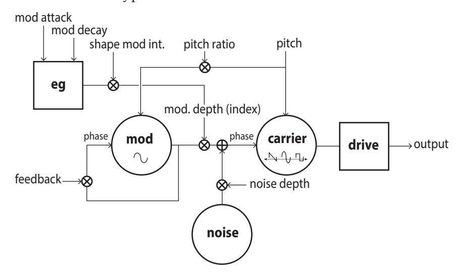

<!-- AI Image Description: _page_20_Figure_2.jpeg -->
> **[Image: _page_20_Figure_2.jpeg]** Signal flow block diagram for an FM (frequency modulation) synthesis engine, likely the Multi Engine's FM type on the Korg Minilogue XD. The diagram shows two oscillators: a 'mod' (modulator) oscillator and a 'carrier' oscillator. The modulator feeds its phase output through a multiplier controlled by 'mod. depth (index)' into the carrier's phase input. The carrier oscillator shows selectable waveform icons (sine, triangle, sawtooth, square). The carrier output feeds into a 'drive' block, which then goes to 'output'. A 'pitch ratio' parameter is multiplied with 'pitch' and fed to the modulator. The same 'pitch' signal also goes directly to the carrier. An 'eg' (envelope generator) block receives 'mod attack' and 'mod decay' inputs, and its output is multiplied by 'shape mod int.' before being summed into the modulation depth path. A 'feedback' path loops the modulator output back into its own phase input via a multiplier. A 'noise' source feeds through a 'noise depth' multiplier into the carrier's phase input as well. This diagram illustrates the complete FM synthesis architecture with envelope-controlled modulation depth, feedback FM, noise injection, and post-carrier drive/distortion.

#### **TYPE knob [Sin1...Throat]**

This selects the oscillator type to use.

The name of the oscillator type will be indicated on the MULTI ENGINE display.

Tip: For the last four types after Decay1, setting Shape Mod Int to "–100%" will disable completely the effect of the EG.

**Sin1**: A basic oscillator type, using a sine wave for both the carrier and modulator.

**Sin2**: Sine wave carrier and a modulator with self-feedback.

**Sin3**: Sine wave carrier with a 3x harmonics modulator.

**Sin4**: Sine wave carrier with 5x harmonics modulator.

**Saw1**: Modulated sawtooth carrier basic type.

**Saw2**: Carrier using a sine wave to simulate a sawtooth.

**Squ1**: Square wave carrier type.

**Squ2**: Carrier using a sine wave to simulate a square wave.

**Fat1**: 1/4 subharmonic modulator with self-feedback and driven carrier output, emphasizing the lower harmonics.

**Fat2**: 3/4 subharmonic modulator with self-feedback and driven carrier output, emphasizing the lower harmonics.

**Air1**: Noise-modulated sine wave carrier.

**Air2**: Sine wave carrier modulated by both noise and a sine wave.

**Decay1**: Type with decaying modulation amount.

Tip: You can edit the relative offsets of the internal EG decay time of the VPM (see block diagram) by using the parameters in PROGRAM EDIT mode ["Button 10 \(MULTI ENGINE\)"](#page-38-0)  [\(p.39\).](#page-38-0)

**Decay2**: Type with strong decaying modulation amount.

**Creep, Throat**: Experimental, somewhat atonal type with complex and evolving modulations.

#### **SHAPE knob**

Turning the SHAPE knob only will set the "MOD DEPTH," and turning the SHAPE knob while holding down the SHIFT button will set the "RATIO OFFSET."

These parameters are common for all oscillator types, and produce the following effects.

#### **SHAPE knob effects**

| Type   | Parameter                                 | Effect                                                                                                                |
|--------|-------------------------------------------|-----------------------------------------------------------------------------------------------------------------------|
| Common | MOD DEPTH (SHAPE knob)                 | [0.00:15.00] (range changes depending on TYPE) This adjust the index and sets the intensity of the modulator.   |
|        | RATIO OFFSET (SHIFT button+SHAPE knob) | [1:4, 1:2, 1:1, 2:1] (range changes depending on TYPE) This adjusts the modulator ratio and adds over tones. |

Tip: Besides the SHAPE knob, the oscillator settings can be changed in detail with six parameters in PROGRAM EDIT mode. See ["When the VPM oscillator is selected" \(p.39\)](#page-38-1) for details.

#### **USR**

You can load your own oscillator programs into a user oscillator to make sounds on the minilogue xd.

Up to 16 user oscillators can be saved. One factory-set default user oscillator is included with the minilogue xd for demo purposes.

See the "logue SDK" (www.korg.com) for details.

#### **TYPE knob**

Selects a user oscillator.

The name of the user oscillator will be indicated on the MULTI ENGINE display.

#### **SHAPE knob [0.0%... 100.0%]**

Produces the effect that is set for the user oscillator.

## **MIXER section**

Use this section to set the output levels of oscillator 1, 2 and the MULTI ENGINE, and to adjust the balance.

| VCO 1 knob | [01023] |
|------------|---------|
| VCO 2 knob | [01023] |
| MULTI knob | [01023] |

These knobs control the output levels.

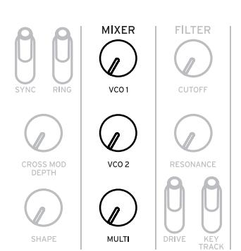

<!-- AI Image Description: _page_21_Picture_19.jpeg -->
> **[Image: _page_21_Picture_19.jpeg]** Close-up illustration of a section of the Minilogue XD front panel showing controls from three sections: left column has VCO-related controls (SYNC toggle switch, RING toggle switch, CROSS MOD DEPTH knob, and SHAPE knob), middle column is the MIXER section (VCO 1 level knob and VCO 2 level knob, MULTI level knob), and right column is the beginning of the FILTER section (CUTOFF knob, RESONANCE knob, DRIVE toggle switch, and KEY TRACK toggle switch). The SYNC and RING are two-position toggle switches. CROSS MOD DEPTH and SHAPE are rotary knobs. In the MIXER section, VCO 1, VCO 2, and MULTI are all rotary knobs controlling the mix levels of the two analog VCOs and the multi-engine oscillator. The FILTER section shows CUTOFF and RESONANCE as large rotary knobs, with DRIVE and KEY TRACK as smaller toggle switches at the bottom. Some controls appear grayed out (inactive/not highlighted) while the MIXER and FILTER sections are emphasized.

## **FILTER section**

### **VCF** VCF: Voltage Controlled Filter

The low-pass filter creates a brighter or darker sound by selectively filtering certain parts of the harmonic spectrum of the sound generated by the oscillators and the noise generator.

#### **CUTOFF knob [0...1023]**

This knob is used to set the cutoff frequency (the frequency at which the filter is applied).

Turning the knob to the left will lower the cutoff frequency, and turning the knob to the right will raise the cutoff frequency.

If the CUTOFF value is set too low, the volume may be extremely low.

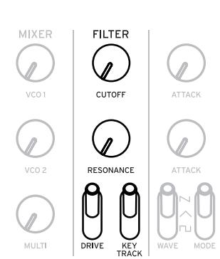

<!-- AI Image Description: _page_22_Picture_7.jpeg -->
> **[Image: _page_22_Picture_7.jpeg]** Close-up illustration of the Minilogue XD front panel focusing on the FILTER section and adjacent controls. The left column shows grayed-out MIXER knobs (VCO 1, VCO 2, MULTI). The center column is the FILTER section, prominently highlighted, containing: CUTOFF knob (large rotary, controls the filter cutoff frequency), RESONANCE knob (large rotary, controls filter resonance/Q), DRIVE toggle switch (adds overdrive/saturation to the filter), and KEY TRACK toggle switch (enables keyboard tracking of the filter cutoff). To the right are partially visible controls: ATTACK knob (top, grayed out, part of AMP EG), another ATTACK knob (middle, grayed out, part of EG section), and at bottom right are WAVE and MODE selectors (part of LFO section, grayed out). The FILTER section is the focal point of this image, with all other sections de-emphasized.

#### **RESONANCE knob [0...1023]**

Also known as Peak or Q, the RESONANCE control adds additional emphasis to the overtones occurring at the CUTOFF frequency, giving a distinctive character to the sound.

Turning the knob to the right will emphasize the harmonic content, increasing the resonance effect.

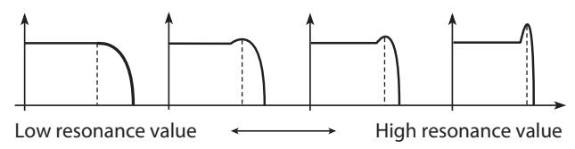

<!-- AI Image Description: _page_22_Picture_11.jpeg -->
> **[Image: _page_22_Picture_11.jpeg]** Diagram illustrating the effect of filter resonance on the frequency response of the low-pass filter. Shows a series of frequency response curves (amplitude vs. frequency) progressing from left ('Low resonance value') to right ('High resonance value'). At low resonance, the filter curve shows a gentle slope rolling off high frequencies with minimal peak at the cutoff point. As resonance increases across the four depicted curves, a progressively taller and narrower peak forms at the cutoff frequency. The dashed vertical lines indicate the cutoff frequency position in each curve. At high resonance values, the peak becomes very pronounced and sharp, approaching self-oscillation. The horizontal axis represents frequency and the vertical axis represents amplitude. A double-headed arrow between the labels emphasizes this is a continuous range from low to high resonance.

Tip: The overtones that are emphasized will change depending on the cutoff frequency. For this reason, it's good to adjust the CUTOFF knob while adjusting the RESONANCE knob.

When emphasizing the overtones in this way, the sound may distort depending on the cutoff frequency or the input audio.

#### **DRIVE switch [0%, 50%, 100%]**

Sets the distortion effect produced by the drive circuit, in three stages.

**0%** (switch in the lower position): no drive effect.

**50%** (switch in the center position): drive effect will be set at half strength.

**100%** (switch in the upper position): drive effect will be set at maximum.

#### **KEYTRACK switch [0%, 50%, 100%]**

Key tracking allows the note played on the keyboard to influence the cutoff frequency of the filter. **0%** (lower position): No keyboard tracking will be applied.

**50%** (center position): Keyboard tracking will affect the cutoff frequency, but at only half the amount produced by 100%. For example, playing the C5 note on the keyboard will produce a harmonic that is an augmented fourth higher than the cutoff frequency of C4.

**100%** (upper position): The cutoff frequency will change at the same rate/slope as the pitch of the keyboard, centered on C4. For example, pressing the C5 key will give a cutoff frequency one octave higher than the C4 key.

## **EG/LFO section**

#### **AMP EG** VCA: Voltage Controlled Amplifier / EG: Envelope Generator

These are the settings for the envelope generator (EG), which controls changes in the signal volume of the VCA over time.

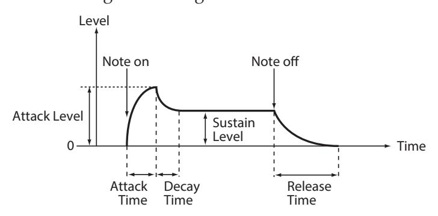

<!-- AI Image Description: _page_23_Figure_4.jpeg -->
> **[Image: _page_23_Figure_4.jpeg]** Standard ADSR (Attack, Decay, Sustain, Release) envelope diagram. The horizontal axis is labeled 'Time' and the vertical axis is labeled 'Level'. The envelope shape begins at zero, then: (1) rises during 'Attack Time' to the 'Attack Level' (peak), triggered by 'Note on' event marked with a downward arrow; (2) falls during 'Decay Time' from the Attack Level down to the 'Sustain Level'; (3) holds at the Sustain Level for as long as the note is held; (4) upon 'Note off' event (marked with another downward arrow), falls during 'Release Time' back to zero. The Attack Level and Sustain Level are marked with dotted horizontal reference lines. Each time segment (Attack Time, Decay Time, Release Time) is indicated with horizontal arrows and dashed vertical boundary lines. This is the standard envelope shape used by both the AMP EG and modulation EG on the Minilogue XD.

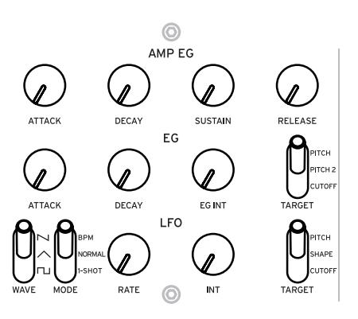

<!-- AI Image Description: _page_23_Figure_5.jpeg -->
> **[Image: _page_23_Figure_5.jpeg]** Illustration of the Minilogue XD front panel showing the modulation section, comprising three subsections arranged in rows. Top row: AMP EG section with four rotary knobs - ATTACK, DECAY, SUSTAIN, and RELEASE. A small LED indicator appears above the section label. Middle row: EG (modulation envelope) section with three rotary knobs - ATTACK, DECAY, and EG INT (envelope intensity) - plus a TARGET selector switch on the right with three positions: PITCH, PITCH 2, and CUTOFF. Bottom row: LFO section with a WAVE selector (showing waveform icons for sawtooth, triangle, and square), a MODE selector switch with three positions (BPM, NORMAL, 1-SHOT), a RATE knob, an INT (intensity) knob, and a TARGET selector switch with three positions: PITCH, SHAPE, and CUTOFF. A small LED indicator appears next to the RATE knob. The LFO wave selector shows waveform shapes visually.

#### **ATTACK knob [0...1023]**

The ATTACK specifies the time required for the EG to reach its maximum level once a new note is played (note-on).

#### **DECAY knob [0...1023]**

The DECAY specifies the time required for the EG to fall to the preset sustain level once the attack portion of the EG is complete.

#### **SUSTAIN knob [0...1023]**

The SUSTAIN specifies the level that will be maintained after the decay time while the key is held down.

#### **RELEASE knob [0...1023]**

The RELEASE specifies the time required for the EG to reach its minimum level (zero) once the key or trigger is released (note off).

#### **EG** EG: Envelope Generator

The envelope generator (EG) is used to change the pitch and cutoff frequency over time.

#### **ATTACK knob [0...1023]**

The ATTACK specifies the time required for the EG to reach its maximum level once a new note is played.

#### **DECAY knob [0...1023]**

The DECAY specifies the time required for the EG to fall to the preset sustain level once the attack portion of the EG is complete.

#### **EG INT knob [–100%... 0%...+100%]**

Adjusts the intensity of the EG.

Turning the knob to the right will increase the intensity.

When set to a negative value, the EG will be applied in the negative direction.

#### **TARGET switch [PITCH, PITCH 2, CUTOFF]**

This sets what the EG will be applied to.

**PITCH**: Applies the EG to the pitch of VCO 1, VCO 2 and the MULTI ENGINE.

**PITCH 2**: Applies the EG to the pitch of VCO 2.

**CUTOFF**: Applies the EG to the cutoff frequency of the FILTER.

#### **LFO** LFO: Low Frequency Oscillator

The LFO is a low frequency oscillator that creates a repeating cyclical signal to modulate the pitch, sound and so on.

Depending on its target, the LFO can provide vibrato (PITCH); tonal changes to the Oscillators (SHAPE); or wah-wah (CUTOFF) effects.

#### **WAVE switch [SQR , TRI , SAW ]**

The LFO can be set to a square wave ( ), a triangle wave ( ), or a sawtooth wave ( ).

#### **MODE switch [1-SHOT, NORMAL, BPM]**

Specifies the range of change and action for the LFO frequency.

**1-SHOT**: The LFO stops after a half-cycle from the time that the sound is played. The range of change for the LFO frequency will be from 0.05 Hz–28 Hz.

**NORMAL**: The range of change for the LFO frequency will be from 0.05 Hz–28 Hz.

**BPM**: This synchronizes the LFO frequency to the sequencer's BPM (beats per minute) set in each program.

#### **RATE knob [0...1023 / 4, 2, 1, 0, 3/4...1/64]**

The RATE knob adjusts the frequency of the LFO.

Turning the knob to the right will increase the LFO frequency.

#### **INT knob [0...511]**

The INT knob adjusts the intensity of the LFO.

Turning the knob to the right will increase the LFO intensity.

Tip: When turning the INT knob while holding down the SHIFT button, the LFO waveform will be inverted. The setting range is 0– –511.

#### **TARGET switch [CUTOFF, SHAPE, PITCH]**

Selects the parameter where the LFO modulation will be applied.

**CUTOFF**: Modulation is applied according to the VCF CUTOFF knob setting.

**SHAPE**: Modulation is applied according to the SHAPE knob setting for the oscillator, which is set in ["LFO Target OSC" \(p.37\)](#page-36-0) of PROGRAM EDIT mode.

**PITCH**: Modulation is applied according to the PITCH knob setting for the oscillator, which is set in ["LFO Target OSC" \(p.37\)](#page-36-0) of PROGRAM EDIT mode.

## **EFFECTS section**

The minilogue xd features high-definition digital effects. You can select one variation from each effect including delay, reverb and modulation, and combine them.

Use the DEL/REV/MOD switch to select the effect type to set. Next, use the OFF/ON/SELECT switch and the TIME and DEPTH knobs to set how the effect will be applied.

The effect on/off state and the values of the TIME and DEPTH knobs are saved along with each effect, so the sound that you set will remain in memory, even if you use the DEL/REV/MOD switch to switch the effect.

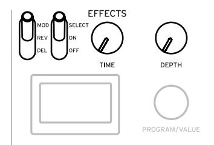

<!-- AI Image Description: _page_25_Picture_4.jpeg -->
> **[Image: _page_25_Picture_4.jpeg]** Illustration of the EFFECTS section of the Minilogue XD front panel. On the left is a SELECT toggle switch with three positions: MOD (modulation effects), REV (reverb), and DEL (delay). Next to it is an ON/OFF toggle switch. To the right are two rotary knobs: TIME and DEPTH. Below these controls is a rectangular display screen (the OLED display), and to its lower right is the PROGRAM/VALUE rotary encoder knob. This section allows the user to select between the three effect types (modulation, reverb, delay), toggle each effect on or off, and adjust the effect's time and depth parameters. The PROGRAM/VALUE encoder is used for navigating and adjusting parameter values shown on the display.

#### **DEL/REV/MOD switch [DEL, REV, MOD]**

Selects the effect type.

**DEL:** Selects the delay effect. **REV**: Selects the reverb effect. **MOD:** Selects the modulation effect.

#### **OFF/ON/SELECT switch [OFF, ON, SELECT]**

This sets the effect that you have selected using the DEL/REV/MOD switch.

**OFF**: Turns the effect off.

**ON**: Turns the effect on.

**SELECT**: When either "DEL" or "REV" is selected using the DEL/REV/MOD switch, flip the switch to SELECT to switch between the sub-types for each effect.

When "MOD" is selected using the DEL/REV/MOD switch, flip the switch to SELECT to switch between the effect types (CHORUS ENSEMBLE PHASER FLANGER USER CHORUS ...). When switching between sub-types, flip the switch to SELECT while holding the SHIFT button down.

Tip: USER (user effects) are not installed as factory-set default effects, so they cannot be selected, but you can load them into the minilogue xd to make them selectable. See the "logue SDK" (www.korg.com) for details.

Note: Both delay and reverb user effects cannot be used at the same time. The effect last selected will be enabled.

For details on the effect types and sub-types, refer to ["Effects list" \(p.59\).](#page-58-1)

#### **TIME knob**

This knob specifies the delay time, reverb time or modulation time. The setting range differs depending on the effect type you select.

Turning the knob to the right will increase the speed or lengthen the time.

#### **DEPTH knob [0.0%... 100%]**

This sets the depth of the effect.

Turning the knob to the right will increase the intensity.

Tip: When either "DEL" or "REV" is selected using the DEL/REV/MOD switch, turn the DEPTH knob while holding down the SHIFT button to adjust the wet/dry balance of each effect. The setting range is MIX WET: 0% – BALANCED – MIX DRY: 0%.

## **Sequencer**

In this section, we'll explore recording with the sequencer, one of the elements that makes up a program. This includes real-time recording, step recording and motion sequence recording, as well as how to edit the recorded sequences (step edit).

We recommend that you save the sequences you have recorded on the minilogue xd.

The sequence data that you record will be lost if you turn off the power or recall a different program before saving.

### **Step recording**

*1.* **Press the REC button in the SEQUENCER section while the sequencer is stopped.**

"STEP REC" and "STEP 1" will be indicated in the display.

If the sequence has already been recorded, the note names will be indicated in the display.

Tip: Select the step you wish to edit. For instance, press button 3 to select step 3.

*2.* **Use the keyboard, REST button and other controls to edit the notes.**

When you record a note, rest, or tie in step mode, the display will automatically move to the next step.

#### **Recording notes**

The note name for the keys you press on the keyboard will be indicated in the display. Check the note name in the display, and if it is correct, release your finger to record that note and to move to the next step.

The note that you played just before releasing your fingers from the keys will be recorded. If you play a wrong note, do not release the key; instead, keep your finger on the wrong note while playing the right note. Check the note indicated in the display, and take your finger off the keyboard to move to the next step.

The ["Default Gate Time" \(p.41\)](#page-40-1) value from SEQ EDIT mode will be used for the note length during recording. If you turn the PROGRAM/VALUE knob while playing the keyboard, the gate time for only the note(s) you played will be changed when recording. If you turn the PROGRAM/VALUE knob while playing buttons 1–16, the gate time for only the step(s) you played will be changed.

#### **Recording a rest**

You can record a rest by pressing the REST button.

#### **Recording a tie**

Press the REST button while holding down a key. The note will be tied to the next note and recorded.

*3.* **When the set number of steps have finished recording, step recording will automatically end.** The number of steps is set for each program. You can change the number of steps using the ["Step Length" \(p.41\)](#page-40-2) function in the SEQ EDIT mode. Turn the PROGRAM/VALUE knob to change the step length during step recording.

Tip: Pressing the REC button at any step during recording will stop the step recording at that step.

### **Real-Time recording**

This feature allows you to record your keyboard performance on the minilogue xd and add overdubs (recording while adding performance data) in real time.

*1.* **Press the PLAY button in the SE-QUENCER section while the sequencer is stopped.**

If a recording already exists, the sequence data will begin playing.

*2.* **Press the REC button.**

Real-time recording will begin, and the REC button will light.

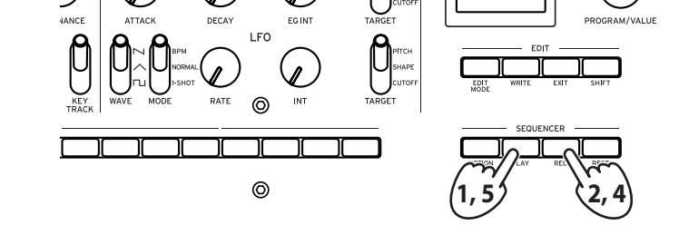

<!-- AI Image Description: _page_27_Picture_6.jpeg -->
> **[Image: _page_27_Picture_6.jpeg]** Illustration showing a wider view of the Minilogue XD front panel, focusing on the lower-right area. Visible sections include the bottom portions of the EG section (KEY TRACK switch), LFO section (WAVE selector, MODE selector with BPM/NORMAL/1-SHOT options, RATE knob with LED, INT knob, TARGET selector with PITCH/SHAPE/CUTOFF), the PROGRAM/VALUE encoder, and the EDIT section with four buttons labeled EDIT MODE, WRITE, EXIT, and SHIFT. Below these are the SEQUENCER section buttons. The image highlights two specific interaction points marked with numbered circles: '1, 5' on the MOTION MODE button (leftmost sequencer button) and '2, 4' on the REST button (rightmost sequencer button). The bottom of the panel shows 16 step buttons and two joystick/performance controls. This image appears to illustrate a step-by-step procedure involving pressing MOTION MODE and REST buttons in sequence.

#### *3.* **Play the keyboard.**

The note(s) you play will be recorded.

#### *4.* **Press the REC button once more to stop the recording.**

The REC button will go dark.

Press the REC button once more to start recording again.

Tip: When you hold down the REST button during real-time recording, the existing notes in the sequence will be deleted.

#### *5.* **Press the PLAY button to finish real-time recording.**

The PLAY button will go dark.

#### **Recording a motion sequence**

Motion sequencing allows you to record the flipping of switches and the turning of knobs as part of the sequence, and recreate those motions automatically during playback.

Up to four motion sequences can be recorded, which includes changes to the knobs and switches.

Note: The knobs, switches for which you cannot record motions are as follows.

MASTER knob, TEMPO knob, OCTAVE switch (MASTER), MULTI ENGINE TYPE-USR, DRIVE switch (FILTER), DEL/REV/MOD switch, SELECT setting of the OFF/ON/SELECT switch.

*1.* **Press the PLAY button to play the sequencer, and then press the MOTION MODE button.** "MOTION VIEW" will appear in the display, and the motion sequence saved to the program will show up as a visual graphic.

<!-- AI Image Description: _page_28_Picture_6.jpeg -->
> **[Image: _page_28_Picture_6.jpeg]** Close-up of the Minilogue XD OLED display showing 'MOTION VIEW' as the header title. Below the title, the display shows a pattern of horizontal bars at various positions across multiple rows, representing motion sequence data. The bars appear as black rectangles of varying lengths and positions against a light background, visualizing recorded parameter automation (motion sequences) across the 16 steps of the sequencer. Each row likely represents a different recorded parameter's motion data, showing when and how parameter values change over the sequence steps.

#### *2.* **Press the REC button.**

Real-time recording will begin.

#### *3.* **Move the knobs and switches on the minilogue xd.**

You can record up to four motion sequences for the knobs and switches.

Note: If you exceed this limit, the message "Motion Full" will be shown in the display, and the display will enter MOTION CLEAR in the SEQ EDIT mode. See steps 2 and afterwards in ["Deleting a motion sequence" \(p.30\)](#page-29-0) for details.

Note: For motion sequences of knobs and switches you moved that are already recorded, the data previously recorded will be overwritten.

#### *4.* **After the set number of steps have finished recording, the Motion Sequence will automatically finish recording as well.**

Follow steps 2 and on to record motion sequences for other knobs and switches. The number of steps is set for each program. You can change the number of steps using the ["Step Length"](#page-40-2)  [\(p.41\)](#page-40-2) function in the SEQ EDIT mode.

#### **Deleting a motion sequence**

You can delete one of the previously recorded motion sequences from ["MOTION CLEAR \(1...4\)"](#page-41-0)  [\(p.42\)](#page-41-0) in SEQ EDIT mode.

Tip: To delete all motion sequences at once, use ["Motion Clear" \(p.41\)](#page-40-3) in SEQ CLEAR, SEQ EDIT mode.

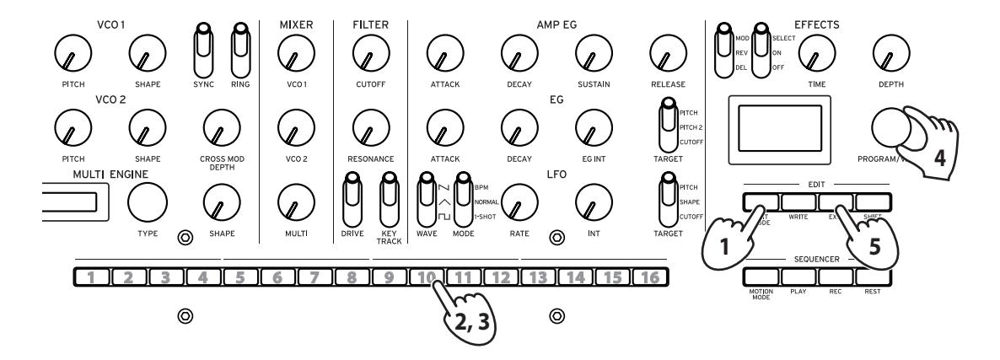

<!-- AI Image Description: _page_29_Picture_3.jpeg -->
> **[Image: _page_29_Picture_3.jpeg]** Full front panel illustration of the Minilogue XD synthesizer, showing all control sections from left to right: VCO 1 (PITCH, SHAPE knobs, SYNC and RING switches), VCO 2 (PITCH, SHAPE knobs, CROSS MOD DEPTH knob), MULTI ENGINE (TYPE selector, SHAPE knob with LED), MIXER (VCO 1, VCO 2, MULTI level knobs), FILTER (CUTOFF, RESONANCE knobs, DRIVE and KEY TRACK switches), AMP EG (ATTACK, DECAY, SUSTAIN, RELEASE knobs), EG (ATTACK, DECAY, EG INT knobs, TARGET selector), LFO (WAVE, MODE, RATE, INT, TARGET), EFFECTS (SELECT, ON/OFF, TIME, DEPTH), OLED display, PROGRAM/VALUE encoder, EDIT buttons (EDIT MODE, WRITE, EXIT, SHIFT), and SEQUENCER buttons (MOTION MODE, PLAY, REC, REST). The 16 step buttons with sliders are shown along the bottom. Numbered interaction points are marked: '1' on the PROGRAM/VALUE encoder, '2, 3' on the step buttons area (around steps 9-10), and '5' on the SHIFT/EXIT area. A hand icon indicates turning the PROGRAM/VALUE knob at position 4. This illustrates a multi-step operational procedure.

*1.* **Press the EDIT MODE button a number of times to select SEQ EDIT mode.**

<!-- AI Image Description: _page_29_Picture_5.jpeg -->
> **[Image: _page_29_Picture_5.jpeg]** Close-up of the Minilogue XD OLED display showing a menu with three items listed vertically: 'PROGRAM EDIT' (highlighted/selected with white text on black background at the top), 'SEQ EDIT' (middle option), and 'GLOBAL EDIT' (bottom option). This is the main edit mode menu that appears when the EDIT MODE button is pressed, allowing the user to choose between editing program parameters, sequencer parameters, or global system parameters.

*2.* **Press button 10 to enter MOTION CLEAR.**

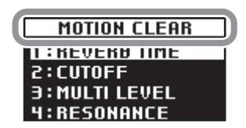

<!-- AI Image Description: _page_29_Picture_7.jpeg -->
> **[Image: _page_29_Picture_7.jpeg]** Close-up of the Minilogue XD OLED display showing a 'MOTION CLEAR' screen. The header reads 'MOTION CLEAR' in inverse text (white on black). Below it is a numbered list of motion sequence parameters that can be cleared: '1: REVERB TIME', '2: CUTOFF', '3: MULTI LEVEL', '4: RESONANCE'. This screen allows the user to select and clear individual motion sequence recordings for specific parameters. The list shows which parameters currently have motion data recorded in the active program's sequence.

Tip: While the SHIFT button is pressed, the MOTION VIEW screen will be displayed, where you can see the graphics for the motion sequences you have recorded.

- *3.* **Press button 10 a number of times to select the motion sequence to delete.**
- *4.* **Turn the PROGRAM/VALUE knob to select "CLEAR...?", and press the WRITE button.** The selected motion sequence will be deleted.
- *5.* **Press the EXIT button.**

#### **Editing sequence data (step edit)**

Using Step Edit, you can edit the notes and motion sequences that you previously recorded into sequence data.

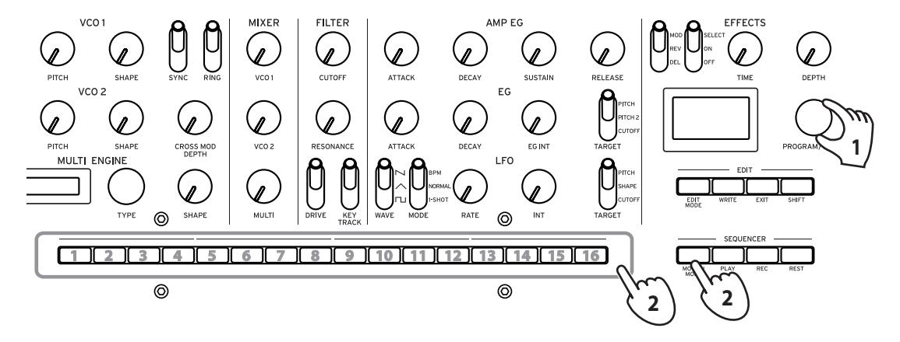

<!-- AI Image Description: _page_30_Picture_2.jpeg -->
> **[Image: _page_30_Picture_2.jpeg]** Full front panel illustration of the Minilogue XD synthesizer showing all control sections. This image highlights a specific operational procedure with two numbered interaction points: '1' is indicated at the PROGRAM/VALUE encoder (with a hand icon showing it being turned), and '2' is indicated at two locations - the PLAY button in the SEQUENCER section and step button 16 in the step button row. The 16 step buttons with their corresponding sliders are shown along the bottom panel, numbered 1-16 and highlighted/boxed to draw attention. All synthesizer sections are visible: VCO 1, VCO 2, MULTI ENGINE, MIXER, FILTER, AMP EG, EG, LFO, EFFECTS, display, EDIT buttons, and SEQUENCER controls. This appears to illustrate a procedure for sequence playback or step selection.

#### *1.* **Select a program that includes the sequence data you wish to edit.**

The MOTION MODE button and buttons 1–16 will light and go dark to show the status for each step.

| Buttons 1–16       |                                 |                                 |
|--------------------|---------------------------------|---------------------------------|
|                    | Button goes dark                | Button lights                   |
| MOTION MODE button |                                 |                                 |
| Button goes dark   | Disabled, or no note data avail | Enabled (note data is recorded) |
|                    | able                            |                                 |
|                    | Disabled, or no motion se       | Enabled (motion sequence data   |
| Button lights      | quence data                     | is recorded)                    |

#### *2.* **Edit the notes and motion sequences for the steps, using the MOTION MODE button and buttons 1–16.**

#### **Play the note.**

Doing so will make the MOTION MODE button go dark.

- Hold down one of buttons 1–16 and play a note on the keyboard to record a note at that step.
- Holding down multiple buttons 1–16 and playing a note on the keyboard will record the same note at all of the selected steps.
- Holding down multiple buttons 1–16 next to each other and playing a note on the keyboard will connect the notes inputted in these steps with a tie.
- If you turn the PROGRAM/VALUE knob while playing buttons 1–16, the gate time for only the step(s) you played will be changed. See ["Default Gate Time" \(p.41\)](#page-40-1) for details on setting the gate time.

#### **Input a motion sequence.**

Doing so will make the MOTION MODE button light up.

Tip: When the MOTION MODE button is lit, the recorded motion sequence will show up as graphics in the display.

- Hold down one of buttons 1–16 and move a knob or switch to record a motion sequence at that step.
- Holding down multiple buttons 1–16 and moving a knob will record the motion sequence at all of the selected steps.

For example, if you hold down buttons 3 and 5 and turn the LFO INT knob to "50%," the LFO INT 50% value will be recorded for steps 3 and 5 respectively. When recording a motion sequence in real time, you can only record continuous changes in value. However, if you use the step recording feature to record changes as a motion sequence, the changes recorded as a motion sequence will be recorded per step.

#### **Enable or disable the steps.**

• Press buttons 1–16 to enable (the button will light) or disable (the button will go dark) the steps.

Note: If a note or motion sequence is not recorded for a step, you cannot enable that step.

#### **Set the active step.**

Using the "Shift Function" in GLOBAL EDIT mode, begin by selecting "Active Step" (the "Favorrite" is already configured by factory default). Refer to ["Shift Function" \(p.47\)](#page-46-1) for details. Pressing buttons 1–16 will turn the motion for the corresponding steps on (the button will light) or off (the button will go dark). If motion has not been recorded for a step, it cannot be turned on.

*3.* **After you finish step editing, press the PLAY button to check your sequence data.** The PLAY button will light.

### **Other editing functions**

Use the SEQ EDIT mode when setting the step length, step resolution and other parameters during sequence step recording, as well as for deleting sequence data, or for editing or deleting motions. See ["SEQ EDIT mode" \(p.40\)](#page-39-3) for details.

## **Edit mode**

Although nearly all of the minilogue xd's main parameters can be edited using the knobs and switches on the panel, the other detailed parameters are accessed using the **Edit mode**. There are three sub-modes within the Edit mode: **PROGRAM EDIT mode**, **SEQ EDIT mode**, and **GLOBAL EDIT mode**.

## **How to enter the Edit mode**

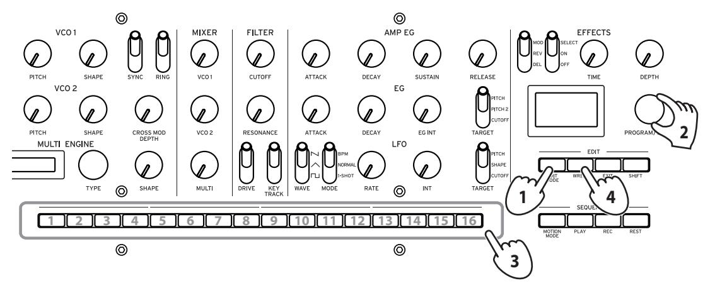

<!-- AI Image Description: _page_32_Figure_3.jpeg -->
> **[Image: _page_32_Figure_3.jpeg]** Full front panel illustration of the Minilogue XD synthesizer showing all control sections in a comprehensive overview. This image highlights a four-step operational procedure with numbered interaction points: '1' on the LFO TARGET selector area, '2' on the PROGRAM/VALUE encoder (with hand icon showing rotation), '3' on the step button area (around step 13-14 region at the bottom), and '4' on the EXIT button in the EDIT section. All synthesizer sections are visible from left to right: VCO 1 (PITCH, SHAPE), VCO 2 (PITCH, SHAPE, CROSS MOD DEPTH), MULTI ENGINE (TYPE, SHAPE), MIXER (VCO 1, VCO 2, MULTI), FILTER (CUTOFF, RESONANCE, DRIVE, KEY TRACK), AMP EG (ATTACK, DECAY, SUSTAIN, RELEASE), EG (ATTACK, DECAY, EG INT, TARGET), LFO (WAVE, MODE, RATE, INT, TARGET), EFFECTS (SELECT, ON/OFF, TIME, DEPTH), OLED display, PROGRAM/VALUE encoder, EDIT section (EDIT MODE, WRITE, EXIT, SHIFT), and SEQUENCER (MOTION MODE, PLAY, REC, REST). The 16 step buttons with sliders span the bottom. This likely illustrates a procedure for editing or configuring a parameter through the edit menu system.

*1.* **Press the EDIT MODE button.**

Each Edit mode is shown in the display, and the buttons light.

<!-- AI Image Description: _page_32_Picture_6.jpeg -->
> **[Image: _page_32_Picture_6.jpeg]** Close-up of the Minilogue XD OLED display showing the same edit mode menu as in _page_29_Picture_5.jpeg. Three menu items are listed vertically: 'PROGRAM EDIT' (at top, highlighted/selected with white text on black background), 'SEQ EDIT' (middle option), and 'GLOBAL EDIT' (bottom option). This is the main edit mode selection screen accessed via the EDIT MODE button, letting the user navigate between program editing, sequencer editing, and global settings editing. In this instance, 'PROGRAM EDIT' appears to be the currently selected/highlighted option.

*2.* **Press the EDIT MODE button a number of times or use the PROGRAM/VALUE knob to select PROGRAM EDIT mode, SEQ EDIT mode, or GLOBAL EDIT mode.**

**PROGRAM EDIT mode**: This mode is used for program editing functions, such as to change the program name and assign a parameter to the joystick or CV INPUT jack, as well as to select a microtuning and so on.

**SEQ EDIT mode**: This mode is used to set the BPM and configure other step sequencer settings, as well as to delete sequence data and so on.

**GLOBAL EDIT mode**: Use this mode to set how the knobs and switches should function, as well as settings such as MIDI for the entire synthesizer.

*3.* **Press one of the lit buttons from 1 to 16.**

The minilogue xd will enter the selected edit mode, and the parameter names will be indicated in the display.

- You can go to the page at right by pressing the same button. Press the same button while holding the SHIFT button down to show the page to the left.
- Turn the PROGRAM/VALUE knob to set the parameters. For more on the parameters, see ["PROGRAM EDIT mode" \(p.35\),](#page-34-2) ["SEQ EDIT mode"](#page-39-3)  [\(p.40\)](#page-39-3) and ["GLOBAL EDIT mode" \(p.43\)](#page-42-1).
- *4.* **Press the WRITE button to save your parameters after you have configured the parameters in PROGRAM EDIT mode and SEQ EDIT mode.**

Tip: Settings in GLOBAL EDIT are saved automatically when going to a different page.

If you select another program after you have configured the parameters in the PROGRAM EDIT mode and the SEQ EDIT mode without saving your changes, your settings will be lost.

## **Edit mode parameter list**

| Button       | 1 | 2 | 3                  | 4                    | 5                    | 6                          | 7                          | 8                    | 9                           | 10                             | 11                         | 12                         | 13                      | 14              | 15                 | 16 |
|--------------|---|---|--------------------|----------------------|----------------------|----------------------------|----------------------------|----------------------|-----------------------------|--------------------------------|----------------------------|----------------------------|-------------------------|-----------------|--------------------|----|
|              |   |   |                    | JOYSTICK (p.35)   | CV INPUT (p.36)   | PITCH SETTING (p.36) | LFO (p.37)              | MODULATION (p.38) | OTHER SETTINGS (p.38) | MULTI ENGINE (p.39)      |                            | PROGRAM NAME (p.39)  | INITIALIZE (p.40)    | DUMP (p.40)  |                    |    |
| ode          |   |   |                    | X+ Bend Range     | CV IN Mode           | Microtuning                | LFO Target OSC          | EG Velocity          | Multi Octave             | Parameter 1 (Feedback)      |                            | PROGRAM NAME            | Initialize Program   | Program Dump |                    |    |
| m T DI |   |   |                    | X– Bend Range     | CV IN1 Assign     | Scale Key                  | LFO Key Sync            | Amp Velocity      | Multi Routing            | Parameter 2 (Noise Depth)   |                            |                            |                         |                 |                    |    |
| M E A     |   |   |                    | Y+ Assign            | CV IN1 Range      | Program Tuning          | LFO Voice Sync          | MIDI Aftertouch   | EG Legato                   | Parameter 3 (Shape Mod Int) |                            |                            |                         |                 |                    |    |
| R G O  |   |   |                    | Y+ Range             | CV IN2 Assign     | Transpose                  |                            |                      | Portamento Mode          | Parameter 4 (Mod Attack)    |                            |                            |                         |                 |                    |    |
| R P       |   |   |                    | Y– Assign            | CV IN2 Range      |                            |                            |                      | Portamento BPM           | Parameter 5 (Mod Decay)     |                            |                            |                         |                 |                    |    |
|              |   |   |                    | Y– Range             |                      |                            |                            |                      | Program Level            | Parameter 6 (Mod Key Track) |                            |                            |                         |                 |                    |    |
|              |   |   |                    |                      | BPM (p.40)        | ARP PARAMETER (p.40) | SEQ PARAMETER (p.41) | SEQ CLEAR (p.41)  |                             | MOTION CLEAR (p.42)      | MOTION ENABLE (p.42) | MOTION SMOOTH (p.42) |                         |                 |                    |    |
| ode m     |   |   |                    |                      | BPM                  | Rate                       | Step Length             | All Clear            |                             | MOTION CLEAR (14)           | MOTION ENABLE (14)      | MOTION SMOOTH (14)      |                         |                 |                    |    |
| T DI      |   |   |                    |                      |                      | Gate Time                  | Step Resolution         | Motion Clear      |                             |                                |                            |                            |                         |                 |                    |    |
| Q E SE    |   |   |                    |                      |                      |                            | Swing                      |                      |                             |                                |                            |                            |                         |                 |                    |    |
|              |   |   |                    |                      |                      |                            | Default Gate Time       |                      |                             |                                |                            |                            |                         |                 |                    |    |
|              |   |   | GLOBAL 1 (p.43) | GLOBAL 2 (p.43)   | GLOBAL 3 (p.45)   | GLOBAL 4 (p.45)         | GLOBAL 5 (p.46)         | GLOBAL 6 (p.47)   |                             | USER SCALE (p.47)        | USER OCTAVE (p.48)   | SCALE CLEAR (p.48)   | SCALE DUMP (p.48) |                 | ALL DUMP (p.49) |    |
| ode          |   |   | Master Tune     | Metronome            | Sync In Unit         | MIDI Route                 | MIDI Rx Prog Chg        | Parameter Disp    |                             | User Scale 16               | User Octave 16          | User Scale 16           | User Scale 16        |                 | All Dump (USB)  |    |
| m T       |   |   | Transpose          | D. Pedal Polarity | Sync Out Unit     | MIDI Ch                    | MIDI Rx CC              | Brightness           |                             |                                |                            | User Octave 16          | User Octave 16       |                 | All Dump (MIDI) |    |
| DI AL E   |   |   |                    | Local SW             | Sync In Polarity  | Clock Source            | MIDI Rx Pitch Bend      | Auto Power Off    |                             |                                |                            |                            |                         |                 |                    |    |
| B O GL |   |   |                    | Velocity Curve    | Sync Out Polarity | En Rx Transport         | MIDI Tx Prog Chg        | Oscilloscope         |                             |                                |                            |                            |                         |                 |                    |    |
|              |   |   |                    | Knob Mode            |                      | Poly Chain                 | MIDI Tx CC              | Shift Function    |                             |                                |                            |                            |                         |                 |                    |    |
|              |   |   |                    |                      |                      |                            | MIDI Tx Pitch Bend      |                      |                             |                                |                            |                            |                         |                 |                    |    |

## **PROGRAM EDIT mode**

#### **Button 4 (JOYSTICK)**

This configures the joystick settings.

#### **X+ Bend Range [Off, 1 Note...12 Note]**

Specifies how much pitch bend will be applied when moving the joystick to the right.

#### **X– Bend Range [Off, 1 Note...12 Note]**

Specifies how much pitch bend will be applied when moving the joystick to the left.

#### **Y+ Assign [GATE TIME...DELAY DEPTH]**

This sets the parameters that are assigned to the joystick when moved upwards. The parameters that can be assigned as shown below.

> GATE TIME PORTAMENTO VOICE MODE DEPTH VCO1 PITCH VCO1 SHAPE VCO2 PITCH VCO2 SHAPE CROSS MOD MULTI SHAPE VCO1 LEVEL VCO2 LEVEL MULTI LEVEL CUTOFF RESONANCE A.EG ATTACK A.EG DECAY A.EG SUSTAIN A.EG RELEASE EG ATTACK EG DECAY EG INT LFO RATE LFO INT MOD TIME MOD DEPTH REVERB TIME REVERB DEPTH DELAY TIME DELAY DEPTH

#### **Y+ Range [–100%...0%...+100%]**

This sets how much the parameters are changed when the joystick is moved upwards.

#### **Y– Assign [GATE TIME...REVERB DEPTH]**

This sets the parameters that are assigned to the joystick when moved downwards. The parameters that can be assigned are the same as those for Y+ Assign. See ["Y+ Assign" \(p.35\)](#page-34-4) for details.

#### **Y– Range [–100%...0%...+100%]**

This sets how much the parameters are changed when the joystick is moved downwards.

#### **Button 5 (CV INPUT)**

Two CV IN jacks are available on the minilogue xd. These jacks let you control the internal parameters via CV (control voltage) input, by connecting a modular synthesizer or other device to the minilogue xd. CV/Gate signals are also supported.

#### **CV IN Mode [Modulation, CV/Gate]**

Sets the input mode for the CV IN 1, 2 jacks.

**Modulation**: Controls the parameters assigned in ["CV IN1 Assign" \(p.36\)](#page-35-2) and ["CV IN2 Assign"](#page-35-3)  [\(p.36\).](#page-35-3)

The input voltage range in modulation mode is from –5V to 5V.

**CV/Gate**: CV1 IN1 is the input jack for pitch CV signals, and CV2 IN2 is the input jack for gate signals. Standard CV (control voltage) and gate signals will play the notes on the minilogue xd. The CV input voltage range in CV/Gate mode is from –3V to 5V. Inputting a 1V signal will generate a C4 note. The minilogue xd is compatible with standard volt/oct signals. The ideal gate signal is a 0–5V pulse.

#### **CV IN1 Assign [GATE TIME...REVERB DEPTH]**

This sets the parameters that are controlled by the CV inputted to the CV IN1 jack.

The parameters that can be assigned are the same as those for Y+ Assign. See ["Y+ Assign" \(p.35\)](#page-34-4) for details.

Note: The parameters cannot be set when CV IN Mode is set to "CV/Gate."

#### **CV IN1 Range [–100%...0%...+100%]**

This sets the degree of change to the parameters by the CV inputted to the CV IN1 jack.

#### **CV IN2 Assign [GATE TIME...REVERB DEPTH]**

This sets the parameters that are controlled by the CV inputted to the CV IN2 jack.

The parameters that can be assigned are the same as those for Y+ Assign. See ["Y+ Assign" \(p.35\)](#page-34-4) for details.

Note: The parameters cannot be set when CV IN Mode is set to "CV/Gate."

#### **CV IN2 Range [–100%...0%...+100%]**

This sets the degree of change to the parameters by the CV inputted to the CV IN2 jack.

#### **Button 6 (PITCH SETTINGS)**

#### **Microtuning [Equal Temp...Reverse, AFX 001...006, DC 001...003, USER SCALE 1...6, USER OCTAVE 1...6]**

Sets the microtuning for the program.

**Equal Temp**: Spacing all semitones at equal pitch intervals, this temperament is the most widely used.

**Pure Major**: Major chords in the primary key selected will be perfectly in tune.

**Pure Minor**: Minor chords in the primary key selected will be perfectly in tune.

**Pythagorean**: This ancient Greek scale is especially effective for playing melodies. It consists of perfect fifths; however, other intervals—the major third in particular—will sound out of tune.

**Werckmeister**: The Werckmeister III scale was used in the later Baroque period, providing equal temperament tuning.

**Kirnberger**: The Kirnberger III scale is used mainly for tuning harpsichords.

**Slendro**: This is an Indonesian gamelan scale with five notes per octave.

**Pelog**: This is an Indonesian gamelan scale with seven notes per octave.

**Ionian**: This is a major scale with seven notes per octave.

**Dorian**: This is a scale with seven notes per octave, with the sixth note of the Ionian scale raised a semitone.

**Aeolian**: This is a natural minor scale with seven notes per octave.

**Major Penta**: This is a major pentatonic scale. **Minor Penta**: This is a minor pentatonic scale. **Reverse**: This is a scale that symmetrically inverts the notes on the keyboard, with C4 as the center. **AFX 001...006**: These are an original scale created by Aphex Twin, set for the entire note range. **DC 001...003**: These are an original scale created by Dorian Concept, set for the entire note range. **USER SCALE 1...6**: These are a user-defined scale based on equal temperament tuning, which lets you alter the pitches of each note over the entire keyboard range in semitones and cents. Refer to ["Microtuning" \(p.50\)](#page-49-1) for how to set this.

**USER OCTAVE 1...6**: These are a user-defined scale based on equal temperament tuning, which lets you alter the pitches of each note in semitones and cents over one octave (C through B). Refer to ["Microtuning" \(p.50\)](#page-49-1) for how to set this.

#### **Scale Key [–12 Note...0 Note...+12 Note]**

Sets the scale key used in microtunings.

The preset tuning is the key of C. Adjust the "Scale Key" setting if you want to use a different key. For example, set the scale key to "+2 Note" if you want to use the key of D.

Note: This setting will have no effect if microtuning is set to "Equal Temp" (equal temperament tuning).

#### **Program Tuning [–50 Cent...0 Cent...+50 Cent]**

This adjusts the tuning of the program in one-cent units (1 semitone=100 cents), over a range of ±50 cents.

#### **Transpose [–12 Note...0 Note...+12 Note]**

Sets the pitch for the program in semitones. The range you can set is within one octave, up and down.

#### **Button 7 (LFO)**

#### **LFO Target OSC [All, VCO1+2, VCO2, Multi]**

This selects the oscillator that modulation will be applied to.

**All**: Modulation is applied to oscillators 1 and 2, as well as the MULTI ENGINE.

**VCO1+2**: Modulation is applied to oscillators 1 and 2.

**VCO2**: Modulation is applied to oscillator 2.

**Multi**: Modulation is applied to the MULTI ENGINE.

#### **LFO Key Sync [Off, On]**

Selects whether the phase of the LFO will be reset with each note-on received from the keyboard.

#### **LFO Voice Sync [Off, On]**

Use the LFO Voice Sync to choose whether the phase of the LFO will be synchronized between voices.

#### **Button 8 (MODULATION)**

#### **EG Velocity [0..127]**

Sets the strength of the Cutoff EG Int using velocity. EG Velocity is used to specify how much the EG Int will change according to the keyboard velocity.

If EG Int is set to any other value besides "0", the keyboard velocity can be used to soften the EG Int.

#### **Amp Velocity [0..127]**

Amp Velocity is used to specify how much the volume will change according to the keyboard velocity.

**0**: The velocity will have no effect.

The larger the value, the more effect that keyboard velocity will have.

#### **MIDI Aftertouch [BALANCE...GATE TIME]**

Sets the parameters to assign to MIDI aftertouch messages from external MIDI devices. The parameters that can be assigned are the same as those for Y+ Assign. See ["Y+ Assign" \(p.35\)](#page-34-4) for details.

#### **Button 9 (OTHER SETTINGS)**

#### **Multi Octave [16΄, 8΄, 4΄, 2΄]**

You can set the transposition of the MULTI ENGINE in octaves.

#### **Multi Routing [Pre VCF, Post VCF]**

This sets whether the MULTI ENGINE is mixed prior to the signal reaching the VCF, or whether to bypass the VCF and mix.

Note: When this is set to "Post VCF," the VCF will not affect the MULTI ENGINE.

#### **EG Legato [Off, On]**

When the voice mode is set to "UNISON" or "CHORD," this sets what happens with the EG when a key is played in legato while another key is being pressed.

**Off**: The EG will be retriggered.

**On**: The EG will not be retriggered.

#### **Portamento Mode [Auto, On]**

**Auto**: When playing in a legato style (playing a new note before any previously played note is released), portamento will be applied.

**On**: Portamento will be applied, even when fully releasing a key and then playing the next note.

#### **Portamento BPM [Off, On]**

**On**: The length of portamento that is set using the PORTAMENTO knob will be synchronized with the BPM (beats per minute).

#### **Program Level [–18.0dB...0.0 dB...+6.0dB]**

Sets the program volume.

This allows you to adjust the volume of a program relative to other programs.

Increasing this value will make the volume louder.

#### **Button 10 (MULTI ENGINE)**

This button configures the MULTI ENGINE settings.

The parameters that are displayed will change, depending on the settings in ["NOISE/VPM/USR](#page-18-1)  [switch" \(p.19\)](#page-18-1), MULTI ENGINE.

#### **When the noise generator is selected**

There are no parameters to set for the noise generator.

#### **When the VPM oscillator is selected**

The VPM oscillator has 16 types, each with six parameters.

You can set these parameters to make changes to the sound.

If all parameters are set to "0%", the effects set in the types will be used, and the effect will increase as the value is increased (+).

#### **Parameter 1 (Feedback) [–100%...0%...+100%]**

Sets the depth of the modulator feedback.

#### **Parameter 2 (Noise Depth) [–100%...0%...+100%]**

Adjusts the depth of the noise modulation.

#### **Parameter 3 (Shape Mod Int) [–100%...0%...+100%]**

Adjusts the depth of the internal EG effect.

#### **Parameter 4 (Mod Attack) [–100%...0%...+100%]**

Adjusts the attack time of the internal EG.

#### **Parameter 5 (Mod Decay) [–100%...0%...+100%]**

Adjusts the decay time for the internal EG.

#### **Parameter 6 (Mod Key Track) [–100%...0%...+100%]**

Adjusts the depth of the modulator effect via keyboard tracking. The higher the sound frequency, the less noticeable the effect becomes.

#### **When the user oscillator is selected**

See the "logue SDK" (www.korg.com) for details.

#### **Button 12 (PROGRAM NAME)**

#### **PROGRAM NAME**

You can create a program name up to 12 characters in length.

Rotate the PROGRAM/VALUE knob to select the desired character, then press button 12 to move the cursor to the next position.

#### **Button 13 (INITIALIZE)**

#### **Initialize Program**

This initializes the currently selected program.

Turn the PROGRAM/VALUE knob until "Press WRITE" is indicated in the display.

Press the WRITE button to initialize the program. The display will indicate the message "Initialized".

#### **Button 14 (DUMP)**

#### **Program Dump**

Transmits the SysEx data for the currently selected program to another minilogue xd, MIDI data filer, computer or other compatible device that is connected to this instrument.

Turn the PROGRAM/VALUE knob until "Press WRITE" is indicated in the display.

Press the WRITE button to send a SysEx program dump from the minilogue xd's MIDI OUT and USB B port. The message "Transmitting" will be shown in the display during data transmission.

## **SEQ EDIT mode**

#### **Button 5 (BPM)**

**BPM [10.0...300.0]**

This parameter sets the tempo of the sequencer in beats per minute (BPM).

#### **Button 6 (ARP PARAMETER)**

**Rate [64th...4th]**

This sets the length of an arpeggiator step.

**64th**: A single step will be set to the length of a sixty-fourth note.

**48th**: A single step will be set to the length of a thirty-second note triplet.

**24th**: A single step will be set to the length of a sixteenth note triplet.

**16th**: A single step will be set to the length of a sixteenth note.

**16.th**: A single step will be set to the length of a dotted sixteenth note.

**12th**: A single step will be set to the length of a eighth note triplet.

**8th**: A single step will be set to the length of an eighth note.

**8.th**: A single step will be set to the length of a dotted eighth note.

**6th**: A single step will be set to the length of a quarter note triplet.

**4th**: A single step will be set to the length of a quarter note.

**Gate Time [0%...100%]**

Sets the arpeggiator gate time to a value from 0 to 100%.

#### **Button 7 (SEQ PARAMETER)**

This group provides control of various sequencer timing and resolution parameters such as Gate Time, Swing, etc.

#### **Step Length [1...16]**

Step Length allows you to set the number of steps used by the Step Sequencer.

Turn the PROGRAM/VALUE knob to change the number of steps during step recording.

#### **Step Resolution [1/16, 1/8, 1/4, 1/2, 1/1]**

The step resolution is used to set the length of each step in the step sequencer.

**1/16**: A single step will be set to the length of a sixteenth note.

**1/1**: A single step will be set to the length of one measure. Use this when you want to play long chords.

#### **Swing [–75%...0%...+75%]**

The Swing parameter adjusts the intensity of the swing. When the voice mode is "ARP", the value set here is also used for the arpeggiator swing.

#### **Default Gate Time [0%...100%]**

The Gate Time is the default value used for each step recorded using the step sequencer. Lower values are more staccato, higher values have a longer gate time. When the voice mode is "ARP", the value set here is also used for the arpeggiator gate time.

#### **Button 8 (SEQ CLEAR)**

This function provides a convenient way to delete all data within a specific sequence.

#### **All Clear**

When using All Clear, all notes and motion sequences contained within the sequence data will be deleted.

Turn the PROGRAM/VALUE knob until "Press WRITE" is indicated in the display.

Press the WRITE button to delete. The display will then indicate the message "Cleared".

#### **Motion Clear**

With Motion Clear, only the motion sequences contained within the sequence data will be deleted.

Turn the PROGRAM/VALUE knob until "Press WRITE" is indicated in the display.

Press the WRITE button to delete all of the motion sequence data. The display will then indicate the message "Cleared".

#### **Button 10 (MOTION CLEAR)**

#### **MOTION CLEAR (1...4)**

You can delete motion sequences one at a time here. See ["Deleting a motion sequence" \(p.30\)](#page-29-0) for details.

Tip: While the SHIFT button is pressed, the MOTION VIEW screen will be displayed, where you can see the graphics for the motion sequences you have recorded.

#### **Button 11 (MOTION ENABLE)**

#### **MOTION ENABLE (1...4) [OFF, ON]**

Use this to enable or disable motion 1–4.

**OFF**: The motion sequence will be disabled, and the parameters will not change (the recorded motion sequence will not be deleted).

Press button 11 to select the motion sequence to configure, and turn the PROGRAM/VALUE knob to select either "OFF" or "ON".

Tip: While the SHIFT button is pressed, the MOTION VIEW screen will be displayed, where you can see the graphics for the motion sequences you have recorded.

#### **Button 12 (MOTION SMOOTH)**

#### **MOTION SMOOTH (1...4) [OFF, ON]**

The motion of a motion sequence (Motion 1–4) can step from one value to the next, or it can transition smoothly from one value to the next by applying MOTION SMOOTH.

**OFF**: The motion sequence will make changes to the sound in steps.

**ON**: The motion sequence will change smoothly, and make smooth changes to the sound.

Press button 12 to select the motion sequence to configure, and turn the PROGRAM/VALUE knob to select either "OFF" or "ON".

Tip: While the SHIFT button is pressed, the MOTION VIEW screen will be displayed, where you can see the graphics for the motion sequences you have recorded.

## **GLOBAL EDIT mode**

#### **Button 3 (GLOBAL 1)**

This button sets the parameters related to the overall pitch (how high or low the sound is). These functions control the tuning and transposition of the minilogue xd.

#### **Master Tune [–50 Cent...0 Cent...+50 Cent]**

This adjusts the overall tuning of the entire minilogue xd in one-cent units (semitone = 100 cents), over a range of ±50 cents.

**0**: A4 is equal to 440 Hz.

#### **Transpose [–12 Note...0 Note...+12 Note]**

Sets the pitch in semitones. The range you can set is within one octave, up and down.

#### **Button 4 (GLOBAL 2)**

#### **Metronome [Off, On]**

Sets whether the metronome will sound during real-time recording.

#### **D. Pedal Polarity [– (KORG), +]**

Sets polarity to the same polarity as the damper pedal that is connected to the DAMPER jack. If the polarities do not match, the damper pedal will not operate correctly.

- **(KORG)**: Use this setting when connecting an optional DS–1H damper pedal (sold separately) or a PS-3/PS-1 pedal switch (sold separately). The polarity of Korg damper pedals and pedal switches is "–" ( : open type).
- **+**: Use this setting when connecting damper pedals with a "+" polarity ( : closed type). If the polarities do not match, the damper pedal will not operate correctly.

#### **Local SW [Off, On]**

Sets the local control.

Normally, this is "On." However, if you are using the minilogue xd with an external sequencer or sequencing software, you will want to set the local connection to "Off" to eliminate the double-triggering of notes caused by MIDI echo.

**Off**: Disconnects the keyboard ( **xd-m** buttons 1–16) from the tone generator.

#### **Velocity Curve [Type 1...8, Const 127]**

**xd** This selects how the minilogue xd changes the volume and sound, in response to velocity (how hard you strike the keys).

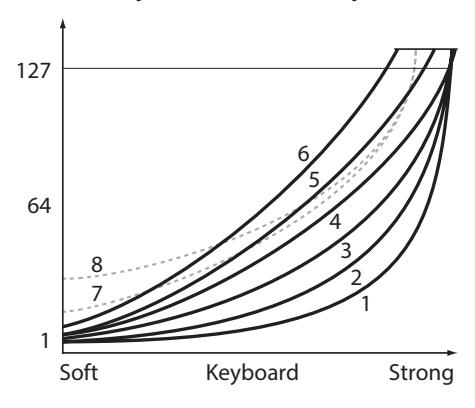

<!-- AI Image Description: _page_42_Figure_21.jpeg -->
> **[Image: _page_42_Figure_21.jpeg]** Velocity curve graph for the Korg Minilogue XD keyboard. The X-axis represents keyboard strike force ranging from 'Soft' (left) to 'Strong' (right). The Y-axis represents the output velocity value ranging from 1 (bottom) to 127 (top), with 64 marked at the midpoint. Eight numbered curves (1 through 8) are displayed, each representing a different velocity curve setting. Curve 1 is the most exponential/convex, requiring very strong key strikes to reach high velocity values, producing a compressed dynamic range for soft playing. Curves 2 through 6 progressively flatten out, with curve 6 being nearly linear but slightly concave, making it easier to reach high velocities with moderate force. Curves 7 and 8 are shown as dashed lines and are concave/logarithmic, meaning even soft key strikes produce relatively high velocity values. All curves start at velocity 1 for the softest touch and converge at velocity 127 for the strongest touch. This chart is used to select the keyboard's velocity response characteristic to match a player's touch preference.

| Type 1    | This curve requires you to play strongly in order to produce an ef fect.                                             |
|-----------|-------------------------------------------------------------------------------------------------------------------------|
| Type 2, 3 |                                                                                                                         |
| Type 4    | This is a typical curve.                                                                                                |
| Type 5    |                                                                                                                         |
| Type 6    | This curve produces an effect without requiring you to play very strongly.                                           |
| Type 7    | This curve produces a fairly steady effect with little change for medi um-strength playing.                          |
| Type 8    | This curve produces a fairly steady effect with little change for medi um-strength playing (a flatter curve than 7). |
| Const 127 | All notes will sound at maximum velocity.                                                                               |

**Curve types 7 and 8** produce little change for medium-strength playing, and are suitable when keyboard velocity is not required, or when you want to play each note at the same velocity. However, these curves will produce a great deal of change with softly played notes, so the sound may be more difficult to control. Choose the curve that is most appropriate for your playing dynamics or for the effect you want to obtain.

#### **Knob Mode [Jump, Catch, Scale]**

The front panel knobs can operate in one of three modes:

**Jump**: When you turn the knob, the parameter value will jump to the value indicated by the knob. Since this makes it easy to hear the results while editing, we recommend that you use this setting. **Catch**: Turning the knob will not change the parameter value until the knob position matches the stored value. We recommend that you use this setting when you don't want the sound to change abruptly, such as while performing.

**Scale**: When you turn the knob, the parameter value will increase or decrease in a relative manner in the direction that it is turned. When you turn the knob and it reaches the full extent of its motion, it will operate proportionate to the maximum or minimum value of the parameter. Once the knob position matches the parameter value, the knob position and parameter value will subsequently be linked.

#### **If the parameter value does not change**

In some cases, the parameter value may not change, even when you turn the knob from left to right. This means that the knob mode is set to "Catch".

In this case, the actual value of the parameter you're editing (the value shown in the display) will not change unless it matches the position of the knob. In Catch mode, the knob position and the value will be linked only when the knob position reaches the actual value. This prevents an unnatural change in sound that is caused when a value suddenly changes.

Let's say that you've turned the knob to edit a certain parameter, and that the knob is in the position shown.

<!-- AI Image Description: _page_43_Picture_10.jpeg -->
> **[Image: _page_43_Picture_10.jpeg]** A rotary knob shown in its center/12-o'clock position. The knob is depicted as a simple circular control with a single line indicator pointing straight up, indicating the default or neutral position. This represents any of the Minilogue XD's panel knobs in their centered detent or starting position.

The actual value of the parameter is at the position shown by the triangle. The parameter value will not change until the knob position reaches the triangle mark.

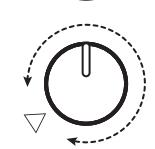

<!-- AI Image Description: _page_43_Picture_12.jpeg -->
> **[Image: _page_43_Picture_12.jpeg]** A rotary knob shown with a dashed curved arrow indicating counter-clockwise rotation. The knob's position indicator line is pointing roughly to the 10-o'clock position. A small open/hollow triangle appears at the lower-left with a left-pointing arrow, indicating the direction of parameter decrease or the starting point of the knob's travel. This illustrates the concept of turning a knob to the left (counter-clockwise) to decrease a parameter value, with the dashed arc showing the rotational movement path.

Once the knob has reached the position corresponding to the actual value, the parameter value and the knob position will be linked, and the value will change as you turn the knob.

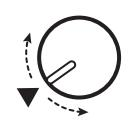

<!-- AI Image Description: _page_43_Picture_14.jpeg -->
> **[Image: _page_43_Picture_14.jpeg]** A rotary knob shown with a dashed curved arrow indicating clockwise rotation from the bottom-left toward the right. The knob's position indicator line is pointing roughly to the 2-o'clock position. A small filled/solid black triangle appears at the lower-left with arrows indicating the direction of rotation. This illustrates the concept of turning a knob to the right (clockwise) to increase a parameter value, with the dashed arc showing the clockwise rotational movement path.

#### **Button 5 (GLOBAL 3)**

These parameters relate to the SYNC IN and OUT jacks settings.

#### **Sync In Unit [16th Note, 8th Note]**

This sets how much the sequencer will advance with each pulse received via the SYNC IN jack.

**16th Note**: The sequencer will advance one sixteenth note for each pulse.

**8th Note**: The sequencer will advance one eighth note for each pulse.

#### **Sync Out Unit [16th Note, 8th Note]**

This sets when to send each pulse via the SYNC OUT jack, according to how far the sequencer has advanced.

**16th Note**: A pulse will be outputted for every sixteenth note.

**8th Note**: A pulse will be outputted for every eighth note.

#### **Sync In Polarity [Rise, Fall]**

In order to achieve synchronization with other units, the polarity of the SYNC IN jack may need to be changed.

**Rise**: The minilogue xd will create a sync pulse as it rises to its crest (the highest point) of the waveform.

**Fall**: The minilogue xd will create a sync pulse as it falls to its trough (the lowest point) of the waveform.

#### **Sync Out Polarity [Rise, Fall]**

In order for other units to correctly sync with the minilogue xd, the polarity of the SYNC OUT jack may need to be changed.

**Rise**: The minilogue xd will create a sync pulse as it rises to its crest (the highest point) of the waveform.

**Fall**: The minilogue xd will create a sync pulse as it falls to its trough (the lowest point) of the waveform.

#### **Button 6 (GLOBAL 4)**

These parameters relate to the minilogue xd's MIDI capabilities.

#### **MIDI Route [USB+MIDI, USB]**

MIDI signals can be sent and received via the MIDI connector and USB port, or by the USB port alone.

**USB+MIDI**: MIDI messages are received via the USB B port and the MIDI IN connector; messages are transmitted from the USB B port and the MIDI OUT connector.

**USB**: MIDI messages will be transmitted and received only via the USB B port. When using the USB port as a MIDI interface, it is advantageous to use this setting.

#### **MIDI Ch [1...16]**

Specifies the MIDI channel of the minilogue xd.

This MIDI channel is used to transmit and receive note messages, as well as control change messages like pitch bend and data dump messages.

#### **Clock Source [Auto (USB), Auto (MIDI), Internal]**

Many features of the minilogue xd can be synchronized to the tempo or BPM. This parameter specifies whether the clock source is internal, or an external MIDI clock source.

**Auto (USB)**, **Auto (MIDI)**: When there is no input, the internal clock will be used. When input is detected, the internal clock will be synchronized to external MIDI clocks from the USB B and MIDI IN connectors respectively.

**Internal**: Only the internal clock will be used.

When a cable is plugged into the SYNC IN jack, the internal clock is synchronized to the SYNC IN jack clock, regardless of the MIDI clock settings.

#### **En Rx Transport [Off, On]**

Sets whether transport-related messages received as part of MIDI real-time messages such as start, stop and continue will be received.

#### **Poly Chain [Off, Master, Slave]**

Sets the poly-chain function.

**Off**: Use the "Off" setting when you will not be connecting devices in poly-chain.

**Master**: Sets this as the master side device when connecting in poly-chain.

**Slave**: Sets this as the slave side device when connecting in poly-chain.

Note: You cannot operate devices that are set to "Slave," besides configuring the global settings and using the MASTER knob, tone parameters are determined by the "Master" unit.

#### **Button 7 (GLOBAL 5)**

#### **MIDI Rx Prog Chg [Off, On]**

Selects whether MIDI program change messages will be received.

#### **MIDI Rx CC [Off, On]**

Selects whether MIDI control change messages will be received.

Tip: CC#1 (Modulation Wheel), CC#64 (Damper) and CC#120 onward cannot be controlled using this setting.

#### **MIDI Rx Pitch Bend [Off, On]**

Selects whether MIDI pitch bend messages will be received.

#### **MIDI Tx Prog Chg [Off, On]**

Selects whether MIDI program change messages will be transmitted.

#### **MIDI Tx CC [Off, On]**

Selects whether MIDI control change messages will be transmitted.

#### **MIDI Tx Pitch Bend [Off, On]**

Selects whether MIDI pitch bend messages will be transmitted.

#### **Button 8 (GLOBAL 6)**

These parameters relate to the minilogue xd's display and power settings.

#### **Parameter Disp [Normal, All]**

**Normal**: Only major information such as operating the pitch-related knobs or switching the effect types will be displayed.

**All**: When any knob except for the MASTER knob and the MULTI ENGINE TYPE knob are turned, the value is shown; and when operating a switch, the setting is shown. Parameters for switches that have an LED may not show up in the display. When the value of the knob or switch is nearly the same as the original, an asterisk ("\*") will be displayed to the right of the value. When the value of the knob or switch is close to the original or when it crosses over the original value, either "" or "" will be displayed.

This will be displayed when operating the knob or switch, and will not be displayed while in Edit mode.

#### **Brightness [1...10]**

Adjusts the display brightness.

Continuous use of the minilogue xd while the brightness is set to a high value will have an adverse effect on the overall life of the display.

#### **Auto Power Off [Off, 4H, 20Min]**

**Off**: The auto power off feature will be disabled.

Note: The unit may consume more power if you set the auto power off feature to "Off".

**4H**: The instrument automatically turns off when four hours have elapsed since the front panel or keyboard was operated, or since a MIDI message was received.

**20Min**: This is the factory default setting. The instrument automatically turns off when 20 minutes have elapsed since the front panel or keyboard was operated, or since a MIDI message was received.

#### **Oscilloscope [Disable, Enable]**

In place of the Program name and number, the oscilloscope feature can be used to show a waveform tracing of the sound.

**Disable**: The display will indicate the Program name and number.

**Enable**: The sound will be displayed as an electrical signal (waveform).

#### **Shift Function [Favorite, Active Step]**

This sets the function that will be used in Play mode when pressing a step button while holding down SHIFT.

**Favorite**: The Favorite function will be used.

**Active Step**: The Active Step function will be used.

#### **Button 10 (USER SCALE)**

#### **USER SCALE 1...6**

These are user-defined scales based on equal temperament tuning. You can alter the pitches of each note over the entire keyboard range in semitones and cents for each user scale.

Turn the PROGRAM/VALUE knob to set the tuning value in cents. Turn the PROGRAM/VALUE knob while holding down the SHIFT button to adjust the tuning value in semitones (100 cents). See ["Microtuning" \(p.50\)](#page-49-1) for details.

When this parameter is displayed, the minilogue xd can receive SysEx microtuning messages. This will overwrite the scale contents you are currently editing, regardless of the numbers specified in the messages.

#### **Button 11 (USER OCTAVE)**

#### **USER OCTAVE 1...6**

This adjusts the pitches of each note in semitones and cents over one octave (C through B), based on equal temperament tuning.

Turn the PROGRAM/VALUE knob to set the tuning value in cents. Turn the PROGRAM/VALUE knob while holding down the SHIFT button to adjust the tuning value in semitones (100 cents). See ["Microtuning" \(p.50\)](#page-49-1) for details.

When this parameter is displayed, the minilogue xd can receive SysEx microtuning messages. This will overwrite the scale contents you are currently editing, regardless of the numbers specified in the messages.

#### **Button 12 (SCALE CLEAR)**

#### **User Scale 1...6**

Initializes the microtunings that were edited in USER SCALE 1–6, button 10.

Press button 12 to select the microtuning to initialize. Turn the PROGRAM/VALUE knob until "Press WRITE" is indicated in the display, and then press the WRITE button.

#### **User Octave 1...6**

Initializes the microtunings that were edited in USER OCTAVE 1–6, button 11.

Press button 12 to select the microtuning to initialize. Turn the PROGRAM/VALUE knob until "Press WRITE" is indicated in the display, and then press the WRITE button.

#### **Button 13 (SCALE DUMP)**

#### **User Scale 1...6**

Transmits the microtunings that were edited in USER SCALE 1–6, button 10 as general SysEx messages.

Press button 13 to select the microtuning to transmit as SysEx. Turn the PROGRAM/VALUE knob until "Press WRITE" is indicated in the display, and then press the WRITE button.

#### **User Octave 1...6**

Transmits the microtunings that were edited in USER OCTAVE 1–6, button 11 as general SysEx messages.

Press button 13 to select the microtuning to transmit as SysEx. Turn the PROGRAM/VALUE knob until "Press WRITE" is indicated in the display, and then press the WRITE button.

#### **Button 15 (ALL DUMP)**

This button transmits the programs, live set and global SysEx data of this instrument to another minilogue xd, MIDI data filer, computer or other compatible device that is connected.

#### **All Dump (USB)**

Turn the PROGRAM/VALUE knob until "Press WRITE" is indicated in the display.

Press the WRITE button to transmit the MIDI data dump via the USB B port. The data will take around 20 seconds to transmit, and the message "Transmitting" will be shown in the display during this time.

If the USB cable is not connected, or if the MIDI IN port on the computer is not open, the data will not be transmitted.

#### **All Dump (MIDI)**

Turn the PROGRAM/VALUE knob until "Press WRITE" is indicated in the display.

Press the WRITE button to transmit the MIDI data dump via the MIDI OUT connector. The data will take around 3 minutes and 15 seconds to transmit, and the message "Transmitting" will be shown in the display during this time.

## **Other functions**

## **Tuning**

As with all analog instruments, the minilogue xd's circuitry can drift over time during performance due to changes in environment and temperature. The minilogue xd provides an **auto-tuning function** that automatically tunes the instrument's analog circuits on demand, to correct for any analog drift. Auto-tuning will be done when the minilogue xd is not producing a sound. As you continue to play the minilogue xd for a while right after you've turned it on, the pitch and tone may gradually drift. If the pitch drift becomes noticeable, use the steps below to tune the minilogue xd. This will manually bring the instrument back into tune.

Note: The internal temperature tends to change more right after the power is turned on, which may cause the instrument to go out of tune.

#### *1.* **Press the REC button while holding down the SHIFT button.**

Tuning will begin, and "Tuning..." will be shown in the display.

The tuning will take about 15 seconds.

Tip: Press the REC button while holding down the SHIFT button again to cancel manual tuning, if you accidentally started it by mistake.

Note: During tuning, you will temporarily be unable to play the minilogue xd.

### **Microtuning**

Microtuning is a feature that changes the pitch of the notes you play on the keyboard (which are normally tuned in equal temperament) to a different tuning.

The minilogue xd features preset microtunings, and lets you create your own microtunings. Twelve microtunings are available to edit. Out of these, you can adjust the pitch on all of the notes on the keyboard for six microtunings called "user scales." The other six microtunings are called "user octaves," which let you change the tuning of each note within one octave, and that octave's tuning will be repeated across the keyboard.

The minilogue xd lets you select a different microtuning for each program. See ["Microtuning"](#page-35-4)  [\(p.36\),](#page-35-4) PROGRAM EDIT mode for details.

#### **Editing the microtunings**

Here, we will edit USER SCALE 3.

#### *1.* **Press the EDIT MODE button to enter GLOBAL EDIT mode.**

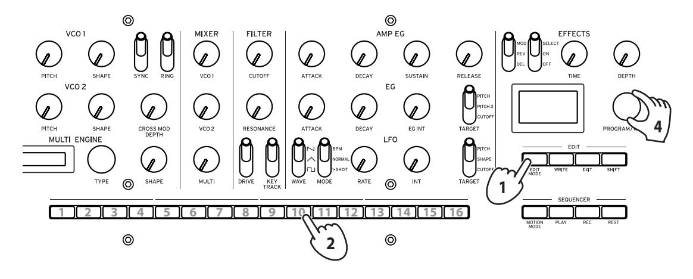

<!-- AI Image Description: _page_49_Figure_16.jpeg -->
> **[Image: _page_49_Figure_16.jpeg]** Full front panel layout diagram of the Korg Minilogue XD synthesizer, annotated with numbered callouts (1, 2, 4 visible). The panel is organized into clearly labeled sections from left to right: VCO 1 (with PITCH, SHAPE, SYNC, and RING knobs), VCO 2 (with PITCH, SHAPE, CROSS MOD DEPTH knobs), MULTI ENGINE (with TYPE selector switch and SHAPE knob), MIXER (with VCO 1, VCO 2, and MULTI level knobs), FILTER (with CUTOFF, RESONANCE, DRIVE knobs, and KEY TRACK switch), AMP EG (with ATTACK, DECAY, SUSTAIN, RELEASE knobs), EG (with ATTACK, DECAY, EG INT knobs and TARGET selector), LFO (with WAVE selector, MODE switch for BPM/NORMAL/1-SHOT, RATE knob, and INT knob with TARGET selector for PITCH/SHAPE/CUTOFF). The EFFECTS section is on the upper right with SELECT switch (MOD/REV/DEL options and ON/OFF), TIME and DEPTH knobs. A display screen is shown in the center-right area. The PROGRAM section includes a large encoder knob (callout 4). Below is a row of 16 step buttons numbered 1-16 (callout 2 points here). The EDIT section has EDIT, WRITE, EXIT, and SHIFT buttons. The SEQUENCER section has MOTION MODE, PLAY, REC, and REST buttons. Callout 1 points to the EDIT button area. This diagram is used to reference the user interface for programming User Scales.

#### *2.* **Press button 10 three times.**

"USER SCALE 3" will be indicated in the display.

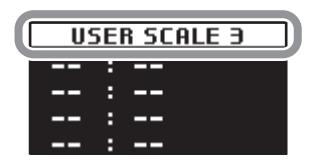

<!-- AI Image Description: _page_50_Picture_2.jpeg -->
> **[Image: _page_50_Picture_2.jpeg]** Minilogue XD OLED display screenshot showing the User Scale editing interface. The display title bar reads 'USER SCALE 3'. Below the title, the display shows a grid/matrix of dashes ('--') separated by colons, representing unset or empty scale note slots. Each pair of dashes represents a note assignment position in the user-defined scale. This is the initial empty state of User Scale 3 before any notes have been programmed, showing the template ready for note entry.

*3.* **Play the note on the keyboard that you want to edit.**

The note name will be indicated in the display.

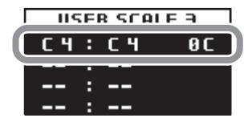

<!-- AI Image Description: _page_50_Picture_5.jpeg -->
> **[Image: _page_50_Picture_5.jpeg]** Minilogue XD OLED display screenshot showing the User Scale editing interface with a note being edited. The display title reads 'USER SCALE 3' (partially visible). The first row shows 'C4 : C4    0C' where the first 'C4' (highlighted/selected in the top line) represents the original note, the second 'C4' represents the tuned/mapped note, and '0C' represents the cent offset (0 cents, no detuning). Below this first entry, remaining slots show dashes ('--') indicating they are still unset. This shows the initial step of programming where C4 is mapped to itself with zero cent deviation.

While this screen is displayed, the minilogue xd will play use the microtuning you are currently editing.

Tip: You can play up to four notes at the same time to edit their tunings together.

*4.* **Turn the PROGRAM/VALUE knob to set how many cents you want to detune the note compared to equal temperament tuning.**

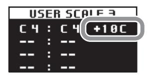

<!-- AI Image Description: _page_50_Picture_9.jpeg -->
> **[Image: _page_50_Picture_9.jpeg]** Minilogue XD OLED display screenshot showing the User Scale editing interface with a cent offset value being modified. The display title reads 'USER SCALE 3' (partially visible). The first row shows 'C4 : C4' with the value '+10C' circled/highlighted on the right side, indicating the cent offset has been changed to +10 cents. This demonstrates how to adjust the micro-tuning offset for a particular note in the user scale, shifting the pitch of C4 up by 10 cents from standard equal temperament. Below, remaining slots show dashes indicating unset entries.

You can also turn the PROGRAM/VALUE knob while holding down the SHIFT button to have the note you are playing sound a different note.

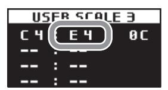

<!-- AI Image Description: _page_50_Picture_11.jpeg -->
> **[Image: _page_50_Picture_11.jpeg]** Minilogue XD OLED display screenshot showing the User Scale editing interface with the target note being changed. The display title reads 'USER SCALE 3' (partially visible). The first row shows 'C4' on the left, then 'E4' circled/highlighted in the middle, and '0C' on the right. This indicates that the original note C4 is now being remapped to E4 with 0 cents offset, demonstrating how to change the destination note in a user scale mapping. The user has changed the target pitch from C4 to E4. Below, remaining slots show dashes indicating unset entries.

When editing the **USER OCTAVE**, use step 2 above to display the USER OCTAVE screen by pressing button 11, and proceed from step 3.

## **Poly-chain**

You can use this function to poly-chain this instrument to another minilogue xd, letting you play them together as an eight-voice synthesizer.

First of all, set the device on the master side to "Master," and the device on the slave side to "Slave."

Next, connect the MIDI OUT connector of the master side to the MIDI IN connector of the slave side using a MIDI cable.

Audio signals will be outputted through each device respectively. Use an external mixer or other device to adjust the signal volumes from the OUTPUT jacks of both instruments.

When playing the master side device, voices 5–8 will sound on the slave side, and you can play a total of eight voices. Refer to ["Poly Chain" \(p.46\)](#page-45-0) for details.

## **Restoring the factory settings**

You can restore the minilogue xd's preset programs and global settings to their original factory-set state at any time.

- *1.* **Begin with the minilogue xd turned Off.**
- *2.* **While holding down the WRITE button and the EXIT button, turn the minilogue xd On.** "FACTORY RESET" will be indicated in the display.
- *3.* **Turn the PROGRAM/VALUE knob to select the items you wish to reset to the factory default settings.**

**PRESET**: Restores the preset programs (001–200) and the live set to their factory-set default settings.

If you do not want to erase the preset programs, press the WRITE button to save them to the user programs (201–500).

**GLOBAL**: Restores the GLOBAL settings to their factory-set default settings.

**ALL**: Restores the preset programs, user programs, the live set and GLOBAL settings to their factory-set default settings.

Use caution, as this will replace all data with the factory-set default settings (including the sounds saved to the user programs).

#### *4.* **Press the WRITE button.**

The display will indicate the message "Are you sure?".

*5.* **Turn the PROGRAM/VALUE knob to select "Yes", and press the WRITE button.**

The factory-set default data will be reloaded, and the minilogue xd will be restored to its factory default state.

Never turn off the minilogue xd while data is being loaded. Doing so might damage the internal data.

## **Shortcuts using the SHIFT button**

By holding down the SHIFT button as you press other buttons, you can access a number of convenient features quickly and easily.

| Function                                 | SHIFT button +            |                                                                                                                                                                                                                   |
|------------------------------------------|---------------------------|-------------------------------------------------------------------------------------------------------------------------------------------------------------------------------------------------------------------|
| Load panel infor mation (LOAD PNL) | Play mode WRITE button | Loads the state of the front panel switches and knobs into the selected program. Used to make the sound match the state of the controls on the front panel.                                              |
| Tuning (TUNING)                       | Play mode REC button   | You can retune the minilogue xd manually if the tuning seems to be drifting. Press the REC button while holding down the SHIFT button to cancel the operation, before performing any other operation. |

| Function                                                | SHIFT button +                                                                                                                                                         |                                                                                                                                                                                                                                                                                                         |
|---------------------------------------------------------|------------------------------------------------------------------------------------------------------------------------------------------------------------------------|---------------------------------------------------------------------------------------------------------------------------------------------------------------------------------------------------------------------------------------------------------------------------------------------------------|
| Delete sequence data (SEQ CLR)                    | Play mode REST button                                                                                                                                               | This deletes all sequence data (including notes and motion sequences) in the selected pro gram. Press the REST button while holding down the SHIFT button once more changes to cancel the operation, before changing the sequence data and before performing any other opera tion. |
| MULTI ENGINE parameter settings (ALT)             | Play mode When selecting "VPM" for the MULTI ENGINE us ing the NOISE/VPM/USR switch: SHAPE knob (MULTI ENGINE)                                          | This adjusts the modulator ratio.                                                                                                                                                                                                                                                                       |
|                                                         | Play mode When selecting "NOISE" for the MULTI ENGINE using the NOISE/VPM/USR switch and set to "Decim" for the TYPE knob: SHAPE knob (MULTI ENGINE) | Adjusts the depth of the sample rate via key board tracking.                                                                                                                                                                                                                                         |
| Selects the modu lation effect sub type (TYPE) | Play mode When selecting "MOD" using the DEL/REV/MOD switch: (EFFECTS) OFF/ON/SELECT switch                                                             | Each time you flip the OFF/ON/SELECT switch to SELECT while holding the SHIFT button, a different effect sub-type is set.                                                                                                                                                                         |
| Wet/dry settings for delay and re verb            | Play mode When selecting "DEL" or "REV" using the DEL/REV/ MOD switch: DEPTH knob                                                                          | Adjust the wet/dry mix for the delay or re verb.                                                                                                                                                                                                                                                     |
| Select a program                                        | Play mode PROGRAM/VALUE knob                                                                                                                                        | Selects a program either 10 programs before or after the currently selected program.                                                                                                                                                                                                                 |
| Select a favorite program                            | Play mode When "Favorite" is selected using Shift Function: Buttons 1–16                                                                                      | Press a button from 1–16 while holding the SHIFT button to recall a favorite program previously registered to that button.                                                                                                                                                                        |
| Register a favorite program                          | Play mode When "Favorite" is selected using Shift Function: Buttons 1–16                                                                                      | Hold down a button from 1–16 while holding the SHIFT button to register the current pro gram as a favorite program.                                                                                                                                                                               |
| Active step set tings                                | Play mode When "Active Step" is select ed using Shift Function: Buttons 1–16                                                                                  | Switches each step ON and OFF.                                                                                                                                                                                                                                                                          |
| Pitch settings                                          | Play mode (VCO1, VCO2) PITCH knob                                                                                                                                   | Sets the pitch in semitones.                                                                                                                                                                                                                                                                            |

| Function                       | SHIFT button +                                                                                 |                                                                                                                                                                                                                                                                                                                                                                                                                                                                            |
|--------------------------------|------------------------------------------------------------------------------------------------|----------------------------------------------------------------------------------------------------------------------------------------------------------------------------------------------------------------------------------------------------------------------------------------------------------------------------------------------------------------------------------------------------------------------------------------------------------------------------|
| LFO waveform phase settings | Play mode INT knob (LFO)                                                                    | This allows you to invert the phase of the LFO waveform.                                                                                                                                                                                                                                                                                                                                                                                                                |
| Editing the micro tunings   | GLOBAL EDIT mode When selecting "USER SCALE" or "USER OC TAVE": PROGRAM/VALUE knob | Sets the pitch in units of 100 cents (semitones).                                                                                                                                                                                                                                                                                                                                                                                                                          |
| Key trigger                    | Play mode PLAY button                                                                       | While holding down the SHIFT button, press the PLAY button to turn the key trigger on (the PLAY button blinks). Hold down the PLAY button while pressing the SHIFT button to set the key trigger to hold (the SHIFT and PLAY buttons blink). When the key trigger is set to hold and the SHIFT button is pressed, key trigger hold will turn off. While pressing the SHIFT button once more, press the PLAY button to turn the key trigger off. |

## **Using with other devices**

## **Making connections with the SYNC IN/OUT jacks**

The minilogue xd can be connected to a Korg volca series unit or a device with a SYNC IN/OUT jack to synchronize the tempo when playing with multiple devices.

The SYNC IN/OUT jack cannot be used to receive or transmit start and stop signals. For instance, when you start or stop the minilogue xd's sequencer, this does not start or stop the sequencer of the connected device at the same time.

### **Synchronizing an external device to the minilogue xd**

To synchronize the minilogue xd to other devices such as the volca, use a stereo mini cable to connect the SYNC OUT jack of this instrument to the SYNC IN jack of the external device.

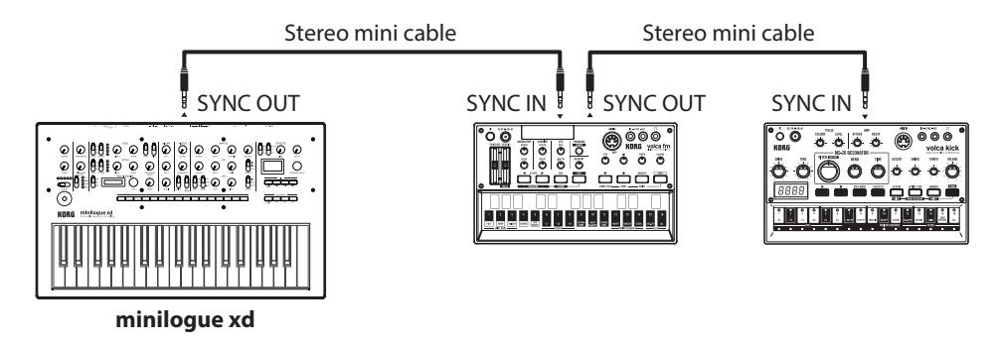

<!-- AI Image Description: _page_54_Picture_6.jpeg -->
> **[Image: _page_54_Picture_6.jpeg]** Sync connection diagram showing the Korg Minilogue XD as the master/primary clock source in a daisy-chain configuration with two Korg Volca units. The Minilogue XD (shown from above with its full keyboard and rear panel) connects its SYNC OUT jack via a stereo mini cable to the SYNC IN jack of a Korg Volca FM (shown from above). The Volca FM's SYNC OUT then connects via another stereo mini cable to the SYNC IN of a Korg Volca Kick (shown from above). This demonstrates tempo synchronization where the Minilogue XD provides the master clock, the Volca FM acts as both a sync slave and passes the clock signal through, and the Volca Kick is the final slave in the chain. All connections use 3.5mm stereo mini cables.

Use the same settings for ["Sync Out Unit" \(p.45\)](#page-44-2) on this minilogue xd and "Sync In Unit" on the first external device to sync. Similarly, use the same settings for "Sync In Unit" on the second external device to sync.

See the owner's manuals of each respective external device to synchronize.

### **Synchronizing the minilogue xd to an external device**

In order to synchronize this instrument to external devices, use a stereo mini cable to connect the SYNC OUT jack of the external device to the SYNC IN jack of the minilogue xd.

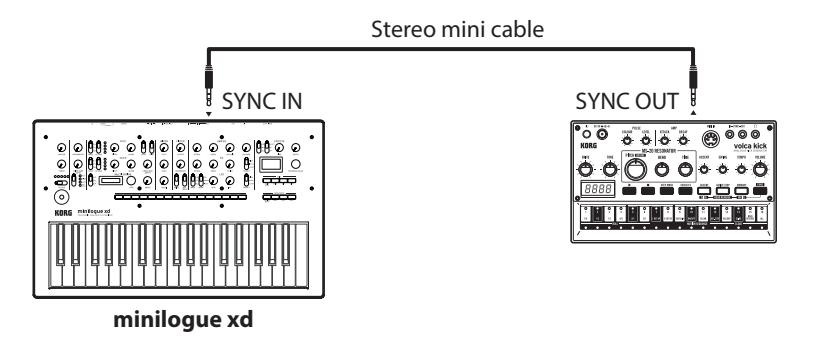

<!-- AI Image Description: _page_54_Picture_11.jpeg -->
> **[Image: _page_54_Picture_11.jpeg]** Sync connection diagram showing the Korg Minilogue XD as a sync slave receiving clock from an external device. A Korg Volca Kick (shown from above on the right) has its SYNC OUT jack connected via a stereo mini cable to the SYNC IN jack on the Minilogue XD (shown from above on the left with its full keyboard and rear panel). This demonstrates the reverse configuration where the Minilogue XD receives tempo sync from an external Volca unit acting as the master clock source. The connection uses a 3.5mm stereo mini cable.

Use the same settings for ["Sync In Unit" \(p.45\)](#page-44-3) on this minilogue xd and "Sync Out Unit" on the external device. Similarly, use the same settings for both the ["Sync In Polarity" \(p.45\)](#page-44-4) and the "Sync Out Polarity" on the external device.

## **Making connections with the CV IN jacks**

Connect these jacks to a external device that can output CV signals to control the minilogue xd. Connect the CV IN jack of the minilogue xd to the CV OUT jack of the external device using a monaural mini cable (or a stereo mini cable).

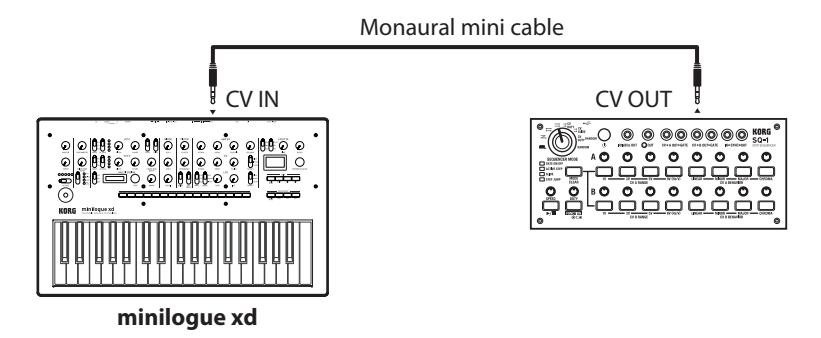

<!-- AI Image Description: _page_55_Picture_2.jpeg -->
> **[Image: _page_55_Picture_2.jpeg]** CV (Control Voltage) connection diagram showing the Korg Minilogue XD receiving pitch CV from an external sequencer. A Korg SQ-1 step sequencer (shown from above on the right) has its CV OUT jack connected via a monaural (mono) mini cable to the CV IN jack on the Minilogue XD (shown from above on the left with its full keyboard and rear panel). This demonstrates how to control the Minilogue XD's pitch via analog control voltage from an external CV sequencer like the SQ-1. The connection uses a 3.5mm mono/monaural mini cable, as noted in the label. The SQ-1 is shown with its two rows of sequencer knobs (channels A and B) and associated controls.

Configure the CV IN jack settings on the minilogue xd from ["Button 5 \(CV INPUT\)" \(p.36\).](#page-35-5) See the owner's manuals of each respective external device to synchronize.

## **Connecting to a MIDI device or a computer**

MIDI stands for Musical Instrument Digital Interface, and is a worldwide standard for exchanging various types of musical data between electronic musical instruments and computers. When MIDI cables are used to connect two or more MIDI devices, performance data can be exchanged between the devices, even if they were made by different manufacturers. MIDI data can also be exchanged between the minilogue xd and your personal computer using a single USB cable. MIDI control change numbers (CC#) are assigned to the main parameters used for altering the sound. You can use an external MIDI sequencer or the like to trigger the sound engine while controlling these parameters. You can also use the front panel knobs or buttons to transmit these control change messages, in order to control an external MIDI device. You can also synchronize the minilogue xd's tempo to the MIDI clock of an external MIDI sequencer or other device, so that the minilogue xd will play in time with the external device and with any changes you make.

## **Controlling an external MIDI tone generator from the minilogue xd**

If you want to use the minilogue xd's keyboard, controllers, and sequencer to play sounds on or control an external MIDI tone generator, connect the minilogue xd's MIDI OUT connector to the external MIDI tone generator's MIDI IN connector using a MIDI cable.

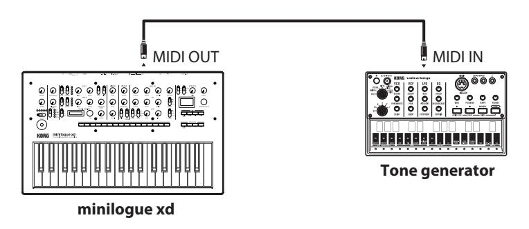

<!-- AI Image Description: _page_55_Picture_8.jpeg -->
> **[Image: _page_55_Picture_8.jpeg]** MIDI connection diagram showing the Korg Minilogue XD sending MIDI data to an external tone generator module. The Minilogue XD (shown from above on the left with its full keyboard and rear panel) has its MIDI OUT jack connected via a MIDI cable to the MIDI IN jack of a tone generator module (shown from above on the right, appears to be a Korg Volca Keys or similar module with knobs and a small keyboard). This demonstrates using the Minilogue XD as a MIDI controller/master to drive an external sound module, sending note data, control changes, and other MIDI messages from the keyboard to trigger sounds on the external device.

### **Controlling the minilogue xd from an external MIDI device**

If you want to play or control the minilogue xd from another MIDI keyboard, sequencer, or other device, connect the MIDI OUT connector of the external MIDI device to the minilogue xd's MIDI IN connector with a MIDI cable.

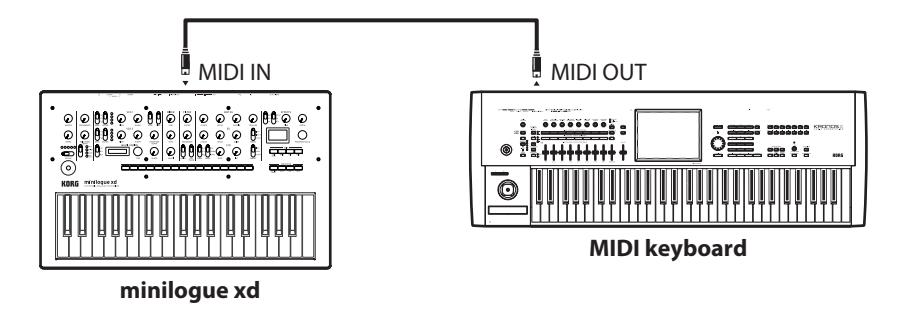

<!-- AI Image Description: _page_56_Picture_2.jpeg -->
> **[Image: _page_56_Picture_2.jpeg]** MIDI connection diagram showing the Korg Minilogue XD receiving MIDI input from an external MIDI keyboard controller. An external MIDI keyboard (shown from above on the right, depicted as a larger workstation-style keyboard with sliders, a display screen, and a full-size keyboard) has its MIDI OUT connected via a MIDI cable to the MIDI IN jack on the Minilogue XD (shown from above on the left with its keyboard and rear panel). This demonstrates using the Minilogue XD as a sound module/tone generator controlled by an external master keyboard, receiving note and control data via the standard 5-pin DIN MIDI connection.

### **Connecting the minilogue xd to an external MIDI sequencer or computer**

You can also play the minilogue xd's keyboard and record your performance on an external MIDI sequencer or computer (connected using the MIDI interface), and then play the minilogue xd while monitoring or playing back what you recorded. Also, you might want to use the minilogue xd as both an input device for playing notes and as a MIDI tone generator. In either case, you'll need to connect the MIDI OUT connector to the MIDI IN connector on both the minilogue xd and the external MIDI sequencer or computer.

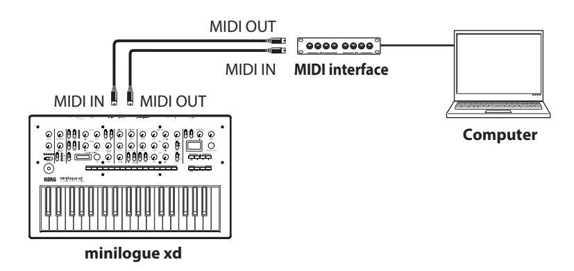

<!-- AI Image Description: _page_56_Picture_5.jpeg -->
> **[Image: _page_56_Picture_5.jpeg]** MIDI connection diagram showing the Korg Minilogue XD connected bidirectionally to a computer via a MIDI interface. The Minilogue XD (shown from above at the bottom-left with its full keyboard and rear panel) has two MIDI cables running to a MIDI interface device (shown at the upper-right as a small rectangular box with multiple MIDI ports). The Minilogue XD's MIDI OUT connects to the MIDI interface's MIDI IN, and the MIDI interface's MIDI OUT connects to the Minilogue XD's MIDI IN, creating a two-way communication path. The MIDI interface is then connected to a laptop computer (shown at the far right) via USB or similar connection. This setup enables bidirectional MIDI communication between the Minilogue XD and DAW software or other music applications running on the computer, allowing both recording of performance data from the synth and sending MIDI control/notes from the computer to the synth.

Some MIDI interface devices may be unable to transmit or receive MIDI SysEx messages to or from the minilogue xd.

Tip: It's convenient to use the USB port when connecting the minilogue xd to a computer.

### **Connecting the minilogue xd to a computer via USB**

In order to use a USB connection, you'll need to install the Korg USB-MIDI driver on your computer. Download the "Korg USB-MIDI driver" from the Korg website, and install it as described in the accompanying documentation.

If either the MIDI connection or the USB connection is not working properly, check the settings in ["MIDI Route" \(p.45\)](#page-44-5).

### **MIDI-related settings (after making connections)**

#### **Setting the MIDI channel**

In order to exchange data with a connected external MIDI device, you must set the minilogue xd's MIDI channel to match the MIDI channel of the external MIDI device.

Refer to ["MIDI Ch" \(p.45\)](#page-44-6) to set the minilogue xd's MIDI channel.

Tip: When synchronizing to an external MIDI device, refer to that device's owner's manual.

#### **Configuring the MIDI "LOCAL" setting when connected to an external MIDI sequencer or computer**

The Echo Back setting of your external MIDI sequencer or computer system allows the MIDI notes and other messages being played by the minilogue xd to be instantly passed along to any other MIDI equipment, including synthesizers, tone generators. However, this same Echo Back function can cause the minilogue xd to double trigger: once when you play the note, and a second time as the external MIDI sequencer of computer system sends the note back to the minilogue xd. To prevent this from happening, you can simply turn off the ["Local SW" \(p.43\)](#page-42-4) in GLOBAL EDIT mode on the minilogue xd.

#### **MIDI filter settings**

Use these settings to configure whether program changes, control changes and pitch bend messages will be transmitted and received.

Use ["Button 7 \(GLOBAL 5\)" \(p.46\)](#page-45-2) to make these detailed settings.

#### **Synchronizing your performance with the sequencer**

Use ["Clock Source" \(p.46\)](#page-45-3) to set whether the minilogue xd will be the master (the device controlling the synchronization) or the slave (the device being controlled) when the sequencer is playing.

When synchronizing to an external MIDI device, refer to that device's owner's manual.

#### **Using the minilogue xd as the master to slave external MIDI devices**

Connect the MIDI OUT connector of the minilogue xd to the MIDI IN connector of your external MIDI device(s).

Set the ["Clock Source" \(p.46\)](#page-45-3) on the minilogue xd to "Internal". Configure the external MIDI device to receive clock data via MIDI. The minilogue xd will act as the master, and the tempo that is set using the TEMPO knob on the minilogue xd will be sent as MIDI timing clock data to operate the external MIDI device (sequencers, rhythm machines, and so on).

### **Slaving the minilogue xd clock to an external MIDI device (master)**

Connect the MIDI IN connector of the minilogue xd to the MIDI OUT connector of your external MIDI device.

Set the ["Clock Source" \(p.46\)](#page-45-3) of the minilogue xd to "Auto (MIDI)," and configure the external MIDI device to transmit MIDI clock data.

The minilogue xd will automatically act as the slave whenever a MIDI timing clock is received, and will be driven by the tempo of the external MIDI device (sequencers, rhythm machines, and so on).

Note: Even if you set the "Clock Source" on the minilogue xd to "Auto (USB)" or "Auto (MIDI)," the minilogue xd will operate in internal MIDI clock mode, unless a clock is received from an external device.

## **Data list**

## **Effects list**

| EFFECT TYPE: DELAY  | SUB TYPE   |                                                                                                      |  |  |
|---------------------|------------|------------------------------------------------------------------------------------------------------|--|--|
| Delay               | Stereo     | A stereo delay with an expansive left-right field.                                                   |  |  |
|                     | Mono       | A straight monaural delay.                                                                           |  |  |
|                     | Ping Pong  | A ping-pong delay that bounces back and forth from left to right.                                 |  |  |
|                     | Hipass     | A delay with a high-pass filter on which the low frequency band fades out.                        |  |  |
|                     | Tape       | Simulates a tape echo.                                                                               |  |  |
|                     | One Tap    | A delay without feedback, on which the delay sounds only once.                                    |  |  |
|                     | Stereo BPM | A stereo delay on which the delay time is synced to the TEM PO button settings.                   |  |  |
|                     | Mono BPM   | A monaural delay on which the delay time is synced to the TEMPO button settings.                  |  |  |
|                     | Ping BPM   | A ping-pong delay on which the delay time is synced to the TEMPO button settings.                 |  |  |
|                     | Hipass BPM | A high-pass delay on which the delay time is synced to the TEMPO button settings.                 |  |  |
|                     | Tape BPM   | A tape echo on which the delay time is synced to the TEMPO button settings.                       |  |  |
|                     | Doubling   | A short delay with a doubling effect.                                                                |  |  |
| EFFECT TYPE: REVERB | SUB TYPE   |                                                                                                      |  |  |
| Reverb              | Hall       | A hall-type reverb that simulates the reverberations of a mid size concert hall or ensemble hall. |  |  |
|                     | Smooth     | A clear reverb with a sustaining high end.                                                           |  |  |
|                     | Arena      | A reverb that evokes the feeling of a spacious area like a stadium.                               |  |  |
|                     | Plate      | A warm-sounding (wet) plate reverb.                                                                  |  |  |
|                     | Room       | A reverb that simulates the reverberations of a small room.                                          |  |  |
|                     | Early Ref  | A reverb that emphasizes the brighter initial reflections than the lingering echoes.              |  |  |
|                     | Space      | An unstable reverb reminiscent of being in space.                                                    |  |  |
|                     | Riser      | A shimmering reverb that echoes one octave higher.                                                   |  |  |
|                     | Submarine  | A deep reverb that echoes one octave lower.                                                          |  |  |
|                     | Horror     | A reverb with a highly unstable tonal quality.                                                       |  |  |

| EFFECT TYPE: MOD | SUB TYPE   |                                                                                                                                                                            |  |  |
|------------------|------------|----------------------------------------------------------------------------------------------------------------------------------------------------------------------------|--|--|
| CHORUS           | Stereo     | A stereo chorus effect that varies the input signal to create a thicker or warmer sound.                                                                                |  |  |
|                  | Light      | A chorus effect with lighter modulation than the stereo type.                                                                                                              |  |  |
|                  | Deep       | A chorus effect with heavier modulation than the stereo type.                                                                                                              |  |  |
|                  | Triphase   | An effect with three choruses, each with different LFO phases.                                                                                                             |  |  |
|                  | Harmonic   | A chorus with slightly emphasized overtones.                                                                                                                               |  |  |
|                  | Mono       | A monaural chorus.                                                                                                                                                         |  |  |
|                  | Feedback   | A chorus that uses feedback to create an effect similar to a short delay.                                                                                               |  |  |
|                  | Vibrato    | Produces a vibrato (wavering) effect.                                                                                                                                      |  |  |
| ENSEMBLE         | Stereo     | An LFO-driven effect with an intricate wavering sound. Pro duces a spatially deep and expansive ensemble effect.                                                        |  |  |
|                  | Light      | An ensemble effect with lighter vibrato than the stereo type.                                                                                                              |  |  |
|                  | Mono       | A monaural ensemble effect.                                                                                                                                                |  |  |
| PHASER           | Stereo     | Alters the phase of the sound to give the sound a swelling effect.                                                                                                      |  |  |
|                  | Fast       | A phaser effect that swells faster than the stereo type.                                                                                                                   |  |  |
|                  | Orange     | An effect that models a popular analog phaser in an orange box.                                                                                                         |  |  |
|                  | Small      | An effect that models the classic New York phaser sound from the 1970s.                                                                                                 |  |  |
|                  | Small Reso | A small-type phaser sound with strong peak components.                                                                                                                     |  |  |
|                  | Black      | An effect modeled after the phaser sounds from Denmark with a wide dynamic range.                                                                                       |  |  |
|                  | Formant    | A phaser derived from the sound of the human voice.                                                                                                                        |  |  |
|                  | Twinkle    | A phaser that creates a twinkling (sparkly) sound.                                                                                                                         |  |  |
| FLANGER          | Stereo     | An effect that creates a thick swelling sound and a sense of motion in pitch.                                                                                           |  |  |
|                  | Light      | A flanger with a thinner effect than the stereo type.                                                                                                                      |  |  |
|                  | Mono       | A monaural flanger.                                                                                                                                                        |  |  |
|                  | High Sweep | A flanger that sweeps through the high-frequency bands.                                                                                                                    |  |  |
|                  | Mid Sweep  | A flanger that sweeps through the mid-frequency bands.                                                                                                                     |  |  |
|                  | Pan Sweep  | A flanger that pans from left to right.                                                                                                                                    |  |  |
|                  | Mono Sweep | A monaural sweeping flanger.                                                                                                                                               |  |  |
|                  | Triphase   | A flanger featuring the effect of three LFOs.                                                                                                                              |  |  |
| (USER)           |            | This effect is not installed at factory-set default, so it cannot be selected. Upload a user effect in order to select. See the "logue SDK" (www.korg.com) for details. |  |  |

## **Program list**

| No | Program Name | Category   | Voice Mode | Author            |
|----|--------------|------------|------------|-------------------|
| 1  | Replicant xd | Pad        | POLY       | Luke Edwards      |
| 2  | TyoCityLoop  | Poly Synth | POLY       | Tomohiro Nakamura |
| 3  | Sharp Fifth  | Poly Synth | POLY       | Artemiy Pavlov    |
| 4  | Quarra       | Poly Synth | POLY       | Tomohiro Nakamura |
| 5  | Terror Key   | Poly Synth | POLY       | KORG Inc.         |
| 6  | PWM Cloud    | Poly Synth | POLY       | Artemiy Pavlov    |
| 7  | Pump SAW     | Poly Synth | POLY       | Tomohiro Nakamura |
| 8  | Orchestra xD | Poly Synth | POLY       | Tomohiro Nakamura |
| 9  | MirroredBass | Bass       | UNISON     | KORG Inc.         |
| 10 | Mr. Squelch  | Bass       | CHORD      | Artemiy Pavlov    |
| 11 | MetalFnkLead | Lead       | CHORD      | Tomohiro Nakamura |
| 12 | Space Clavi  | Poly Synth | POLY       | Tomohiro Nakamura |
| 13 | VelocityStab | Chord      | CHORD      | KORG Inc.         |
| 14 | Bassblaster  | Bass       | CHORD      | KORG Inc.         |
| 15 | Digital Rush | Arp        | ARP        | KORG Inc.         |
|    |              |            |            |                   |
| 16 | OnTheLevel   | Poly Synth | POLY       | Ian Bradshaw      |
| 17 | CheeseRoyale | Poly Synth | POLY       | Taylor McFerrin   |
| 18 | BabeWave     | Poly Synth | POLY       | Nick Kwas         |
| 19 | Pluck VPM    | Poly Synth | POLY       | Tomohiro Nakamura |
| 20 | Pulsating80s | Poly Synth | POLY       | Luke Edwards      |
| 21 | Fifth Kiss   | Poly Synth | POLY       | Artemiy Pavlov    |
| 22 | Warm Dtn     | Poly Synth | POLY       | Tomohiro Nakamura |
| 23 | Funky Stab   | Poly Synth | POLY       | Luke Edwards      |
| 24 | Harp xd      | Poly Synth | POLY       | Tomohiro Nakamura |
| 25 | Future Pulse | Poly Synth | POLY       | Luke Edwards      |
| 26 | Atk&Rel      | Poly Synth | POLY       | Tomohiro Nakamura |
| 27 | Prolly800mk2 | Poly Synth | POLY       | Nick Kwas         |
| 28 | Kawaii Chord | Poly Synth | POLY       | Nick Kwas         |
| 29 | Creep Lights | Poly Synth | POLY       | Tomohiro Nakamura |
| 30 | Trill Synth  | Poly Synth | POLY       | Tomohiro Nakamura |
| 31 | LapisLazuli  | Poly Synth | POLY       | Tomohiro Nakamura |
| 32 | Claymate     | Poly Synth | POLY       | Dorian Concept    |
| 33 | DownStair    | Poly Synth | POLY       | Tomohiro Nakamura |
| 34 | FallingPluck | Poly Synth | POLY       | Dorian Concept    |
| 35 | Rainchild    | Poly Synth | POLY       | Tomohiro Nakamura |
| 36 | Tape*Sine    | Poly Synth | POLY       | Dorian Concept    |
| 37 | Mini Moon    | Poly Synth | POLY       | Nick Kwas         |
| 38 | Petrichor    | Poly Synth | POLY       | Taylor McFerrin   |
| 39 | LoFi Strings | Poly Synth | POLY       | Tomohiro Nakamura |
| 40 | Signal Key   | Poly Synth | POLY       | KORG Inc.         |
| 41 | Organ xd     | Poly Synth | POLY       | Tomohiro Nakamura |
| 42 | Organic Keys | Poly Synth | POLY       | Taylor McFerrin   |
| 43 | K.ORG        | Poly Synth | POLY       | Artemiy Pavlov    |
| 44 | Soapy EP     | Poly Synth | POLY       | Artemiy Pavlov    |
| 45 | Logue Lady   | Poly Synth | POLY       | Nick Kwas         |
| 46 | 90's EPiano  | Poly Synth | POLY       | Tomohiro Nakamura |
|    |              |            |            |                   |
| 47 | XD Seven     | Poly Synth | POLY       | Artemiy Pavlov    |
| 48 | Roadz Bell   | Poly Synth | POLY       | Ian Bradshaw      |
| 49 | Glocken xd   | Poly Synth | POLY       | Tomohiro Nakamura |

| No  | Program Name | Category   | Voice Mode | Author            |
|-----|--------------|------------|------------|-------------------|
| 51  | FantaBell    | Poly Synth | POLY       | Tomohiro Nakamura |
| 52  | GateStepps   | Poly Synth | POLY       | Taylor McFerrin   |
| 53  | Gate 4AM     | Poly Synth | POLY       | Taylor McFerrin   |
| 54  | 1982theme    | Poly Synth | POLY       | Tomohiro Nakamura |
| 55  | LukeWarm Pad | Pad        | POLY       | Luke Edwards      |
| 56  | RiseToPower  | Pad        | POLY       | Luke Edwards      |
| 57  | Eyes Of Owl  | Pad        | POLY       | Tomohiro Nakamura |
| 58  | Nowhere Pad  | Pad        | POLY       | Tomohiro Nakamura |
| 59  | WaveSeq Pad  | Pad        | POLY       | Tomohiro Nakamura |
| 60  | GlasssinePad | Pad        | POLY       | Tomohiro Nakamura |
| 61  | Angelic Vox  | Pad        | POLY       | Artemiy Pavlov    |
| 62  | Plastic Pad  | Pad        | POLY       | Artemiy Pavlov    |
| 63  | Haunted Pad  | Pad        | POLY       | Artemiy Pavlov    |
| 64  | Gaia Dawn    | Pad        | POLY       | Tomohiro Nakamura |
| 65  | Swollen Pad  | Pad        | POLY       | Dorian Concept    |
| 66  | Xtra Fat     | Pad        | POLY       | Artemiy Pavlov    |
| 67  | Sacred Wall  | Pad        | POLY       | KORG Inc.         |
| 68  | Ring PWM     | Pad        | POLY       | Artemiy Pavlov    |
| 69  | BrightStrngs | Pad        | POLY       | Artemiy Pavlov    |
| 70  | Square Drone | Pad        | POLY       | Artemiy Pavlov    |
| 71  | Boombastic   | Bass       | CHORD      | Artemiy Pavlov    |
| 72  | Dirty Trappn | Bass       | UNISON     | Nick Kwas         |
| 73  | M.G.Bass     | Bass       | CHORD      | KORG Inc.         |
| 74  | Octava Bass  | Bass       | CHORD      | Taylor McFerrin   |
| 75  | PWM Bass     | Bass       | CHORD      | Artemiy Pavlov    |
| 76  | Cutie Bass   | Bass       | CHORD      | KORG Inc.         |
| 77  | Anchor Bass  | Bass       | CHORD      | KORG Inc.         |
| 78  | TriKO Bass   | Bass       | CHORD      | Tomohiro Nakamura |
| 79  | Pluck Bass   | Bass       | CHORD      | Artemiy Pavlov    |
| 80  | Sharp Teeth  | Bass       | CHORD      | Artemiy Pavlov    |
| 81  | Hypno Acid   | Bass       | CHORD      | Artemiy Pavlov    |
| 82  | Spike Bass   | Bass       | UNISON     | KORG Inc.         |
| 83  | Pure Vintage | Bass       | CHORD      | Artemiy Pavlov    |
| 84  | Tronic Bass  | Bass       | CHORD      | Artemiy Pavlov    |
| 85  | Multi Bass   | Bass       | CHORD      | Artemiy Pavlov    |
| 86  | Thick Bass   | Bass       | UNISON     | Luke Edwards      |
| 87  | FM Dubz      | Bass       | UNISON     | Luke Edwards      |
| 88  | Brawl Bass   | Bass       | CHORD      | KORG Inc.         |
| 89  | Wire Bass    | Bass       | CHORD      | Tomohiro Nakamura |
| 90  | ScreaFM Bass | Bass       | CHORD      | Tomohiro Nakamura |
| 91  | Dirty Pulse  | Bass       | CHORD      | Artemiy Pavlov    |
| 92  | Crude Pulse  | Bass       | CHORD      | Artemiy Pavlov    |
| 93  | Flat Lead    | Lead       | CHORD      | KORG Inc.         |
| 94  | Cheese Lead  | Lead       | CHORD      | Tomohiro Nakamura |
| 95  | Classic Lead | Lead       | CHORD      | KORG Inc.         |
| 96  | Waard Lead   | Lead       | CHORD      | KORG Inc.         |
| 97  | OrientalLead | Lead       | CHORD      | KORG Inc.         |
| 98  | RingSoloLead | Lead       | CHORD      | KORG Inc.         |
| 99  | Rave Synth   | Lead       | UNISON     | Artemiy Pavlov    |
| 100 | Detuned Saw  | Lead       | UNISON     | Luke Edwards      |

| No  | Program Name | Category | Voice Mode | Author            |
|-----|--------------|----------|------------|-------------------|
| 101 | Pressure     | Lead     | POLY       | KORG Inc.         |
| 102 | Vreeeew      | Lead     | POLY       | Nick Kwas         |
| 103 | EvilSyncLead | Lead     | UNISON     | Tomohiro Nakamura |
| 104 | OvrdriveLead | Lead     | UNISON     | KORG Inc.         |
| 105 | Hybrid       | Lead     | POLY       | Artemiy Pavlov    |
| 106 | Hoover Cloud | Lead     | UNISON     | Artemiy Pavlov    |
| 107 | Dense Lead   | Lead     | CHORD      | Taylor McFerrin   |
| 108 | The Blob     | Lead     | CHORD      | Dorian Concept    |
| 109 | WaveringLead | Lead     | UNISON     | Luke Edwards      |
| 110 | Message From | Lead     | CHORD      | KORG Inc.         |
| 111 | Joystick!    | Lead     | CHORD      | Tomohiro Nakamura |
| 112 | #brew time   | Arp      | ARP        | Luke Edwards      |
| 113 | Duality      | Arp      | ARP        | Artemiy Pavlov    |
| 114 | Cluster 5th  | Arp      | ARP        | Dorian Concept    |
| 115 | Innerstellar | Arp      | ARP        | Tomohiro Nakamura |
| 116 | xdBassRepeat | Arp      | ARP        | Luke Edwards      |
| 117 | Cloud Level  | Arp      | ARP        | Nick Kwas         |
| 118 | Beautyvolver | Arp      | ARP        | Nick Kwas         |
| 119 | Sparkles     | Arp      | ARP        | Artemiy Pavlov    |
| 120 | Trance Vibes | Arp      | ARP        | Artemiy Pavlov    |
| 121 | Warpeggio    | Arp      | ARP        | Dorian Concept    |
| 122 | LetGo Arp    | Arp      | ARP        | Dorian Concept    |
| 123 | Fat Plucks   | Arp      | ARP        | KORG Inc.         |
| 124 | Alarm&Bottle | Arp      | POLY       | KORG Inc.         |
| 125 | Deep Flavor  | Chord    | CHORD      | KORG Inc.         |
| 126 | Piano Chord  | Chord    | CHORD      | Artemiy Pavlov    |
| 127 | Gxyexp Stab  | Chord    | CHORD      | KORG Inc.         |
| 128 | Lush m7      | Chord    | CHORD      | Artemiy Pavlov    |
| 129 | SpiralNebula | Chord    | CHORD      | KORG Inc.         |
| 130 | Third Code   | Chord    | CHORD      | Taylor McFerrin   |
| 131 | Sirens       | SFX      | POLY       | Artemiy Pavlov    |
| 132 | Halo Pad     | SFX      | POLY       | Taylor McFerrin   |
| 133 | Antidote     | SFX      | CHORD      | Taylor McFerrin   |
| 134 | Starship     | SFX      | POLY       | Artemiy Pavlov    |
| 135 | Space Acid   | SFX      | CHORD      | Artemiy Pavlov    |
| 136 | Late Riser   | SFX      | POLY       | Taylor McFerrin   |
| 137 | Doppler Pad  | SFX      | POLY       | Taylor McFerrin   |
| 138 | Disco Callin | SFX      | CHORD      | KORG Inc.         |
| 139 | RuinHitChart | SFX      | UNISON     | Tomohiro Nakamura |
| 140 | Broken Toy   | SFX      | POLY       | Tomohiro Nakamura |
| 141 | PTN Techno1  | Drum     | POLY       | Tomohiro Nakamura |
| 142 | PTN Techno2  | Drum     | CHORD      | Tomohiro Nakamura |
| 143 | PTN DubTch   | Drum     | POLY       | Tomohiro Nakamura |
| 144 | PTN Acieeed? | Drum     | CHORD      | Tomohiro Nakamura |
| 145 | PTN Mutant   | Drum     | POLY       | Tomohiro Nakamura |
| 146 | PTN Mellow   | Drum     | POLY       | Tomohiro Nakamura |
| 147 | Game On!     | Drum     | POLY       | Tomohiro Nakamura |
| 148 | 16bt Bass    | Drum     | CHORD      | Tomohiro Nakamura |
| 149 | VPM Plant    | Drum     | UNISON     | Tomohiro Nakamura |
| 150 | BDSDHHTOM    | Drum     | POLY       | Tomohiro Nakamura |

| No  | Program Name | Category | Voice Mode | Author    |
|-----|--------------|----------|------------|-----------|
| 151 | TPL BasicSaw | Template | POLY       | KORG Inc. |
| 152 | TPL BasicTri | Template | POLY       | KORG Inc. |
| 153 | TPL BasicSqr | Template | POLY       | KORG Inc. |
| 154 | TPL BasicSin | Template | POLY       | KORG Inc. |
| 155 | TPL LayerOct | Template | POLY       | KORG Inc. |
| 156 | TPL Layer5th | Template | POLY       | KORG Inc. |
| 157 | TPL 3sawPoly | Template | POLY       | KORG Inc. |
| 158 | TPL 4sawDuo  | Template | POLY       | KORG Inc. |
| 159 | TPL 8sawMono | Template | UNISON     | KORG Inc. |
| 160 | TPL SyncVCO2 | Template | POLY       | KORG Inc. |
| 161 | TPL RingVCO2 | Template | POLY       | KORG Inc. |
| 162 | TPL XmodVCO2 | Template | POLY       | KORG Inc. |
| 163 | TPL ResoVelo | Template | POLY       | KORG Inc. |
| 164 | TPL ShortTom | Template | POLY       | KORG Inc. |
| 165 | TPL Sweeping | Template | POLY       | KORG Inc. |
| 166 | TPL EG+1shot | Template | POLY       | KORG Inc. |
| 167 | TPL PulseWM  | Template | POLY       | KORG Inc. |
| 168 | TPL VPMmod   | Template | POLY       | KORG Inc. |
| 169 | TPL TrillLFO | Template | POLY       | KORG Inc. |
| 170 | TPL PumpSaw  | Template | POLY       | KORG Inc. |
| 171 | TPL ChordHit | Template | CHORD      | KORG Inc. |
| 172 | TPL RandArp  | Template | ARP        | KORG Inc. |
| 173 | TPL Repeater | Template | ARP        | KORG Inc. |
| 174 | TPL PingPong | Template | POLY       | KORG Inc. |
| 175 | TPL Downpour | Template | POLY       | KORG Inc. |
| 176 | TPL 100%Wet  | Template | POLY       | KORG Inc. |
| 177 | TPL Doubling | Template | POLY       | KORG Inc. |
| 178 | TPL Parroted | Template | POLY       | KORG Inc. |
| 179 | TPL PumpNois | Template | CHORD      | KORG Inc. |
| 180 | TPL DownSmpl | Template | CHORD      | KORG Inc. |
| 181 | TPL ThruVCF  | Template | POLY       | KORG Inc. |
| 182 | TPL 2Sines   | Template | POLY       | KORG Inc. |
| 183 | TPL Reversed | Template | POLY       | KORG Inc. |
| 184 | TPL LongSeq  | Template | POLY       | KORG Inc. |
| 185 | TPL Strings  | Template | POLY       | KORG Inc. |
| 186 | TPL Brass    | Template | POLY       | KORG Inc. |
| 187 | TPL Organ    | Template | POLY       | KORG Inc. |
| 188 | TPL WahClav  | Template | POLY       | KORG Inc. |
| 189 | TPL A.EPiano | Template | POLY       | KORG Inc. |
| 190 | TPL D.EPiano | Template | POLY       | KORG Inc. |
| 191 | TPL A.Bell   | Template | POLY       | KORG Inc. |
| 192 | TPL D.Bell   | Template | POLY       | KORG Inc. |
| 193 | TPL SubBass  | Template | UNISON     | KORG Inc. |
| 194 | TPL LofiSine | Template | CHORD      | KORG Inc. |
| 195 | TPL MonoDriv | Template | CHORD      | KORG Inc. |
| 196 | TPL RoarVPM  | Template | CHORD      | KORG Inc. |
| 197 | TPL Talkie   | Template | POLY       | KORG Inc. |
| 198 | TPL Kick     | Template | POLY       | KORG Inc. |
| 199 | TPL Snare    | Template | POLY       | KORG Inc. |
| 200 | TPL Hats     | Template | CHORD      | KORG Inc. |
|     |              |          |            |           |

| No  | Program Name   | Category | Voice Mode | Author |
|-----|----------------|----------|------------|--------|
| 201 |                |          |            |        |
|     | (Init Program) |          |            |        |
| 500 |                |          |            |        |

All Programs were made by Artemiy Pavlov, Dorian Concept, Ian Bradshaw, Luke Edwards, Nick Kwas, Taylor McFerrin, Tomohiro Nakamura and KORG Inc.

For more information about the authors please visit:

Artemiy Pavlov

https://www.sinevibes.com/

Dorian Concept

https://www.dorianconcept.com/

Taylor McFerrin

https://www.taylormcferrin.com/

Tomohiro Nakamura (aka ghostradioshow)

http://www.youtube.com/user/ghostradioshow

## **Specifications**

| Keyboard (minilogue xd)           | 37 keys (slim keyboard, velocity sensitive)                                                                                                                                                                                                                                                                                                                                                                                                                                          |  |  |
|-----------------------------------|--------------------------------------------------------------------------------------------------------------------------------------------------------------------------------------------------------------------------------------------------------------------------------------------------------------------------------------------------------------------------------------------------------------------------------------------------------------------------------------|--|--|
| Sound generator                   | Analog sound generator + Multi digital sound generator                                                                                                                                                                                                                                                                                                                                                                                                                               |  |  |
| Maximum polyphony                 | 4 voices                                                                                                                                                                                                                                                                                                                                                                                                                                                                             |  |  |
| Programs                          | 500 (200 preset programs and 300 user programs as the factory-set default) Each program includes Voice mode settings. Programs can be set as favorites.                                                                                                                                                                                                                                                                                                                        |  |  |
| Voice mode                        | 4 (ARP/LATCH, CHORD, UNISON, POLY) The VOICE MODE DEPTH knob can used to change parameters that differ for each mode.                                                                                                                                                                                                                                                                                                                                                          |  |  |
| Sequencer                         | 16-step polyphonic sequencer.                                                                                                                                                                                                                                                                                                                                                                                                                                                        |  |  |
| Sound generating system           | 2 VCO (square wave, triangle wave, sawtooth wave), MULTI ENGINE (noise generator, VPM oscillator, user oscillator), 1 VCF, 2 EG, 1 LFO, 1 VCA                                                                                                                                                                                                                                                                                                                                  |  |  |
| Effects                           | DELAY, REVERB, MOD (CHORUS, ENSEMBLE, PHASER, FLANGER, USER)                                                                                                                                                                                                                                                                                                                                                                                                                         |  |  |
| Display                           | Main: Organic EL (electro-luminescence) display with oscilloscope function MULTI ENGINE section: 7-segment LED, 6 characters x 1 line                                                                                                                                                                                                                                                                                                                                             |  |  |
| Input/output jacks                | Headphones jack (6.3mm stereo phone jack) OUTPUT L/MONO and R jacks (6.3mm monaural phone jack, unbalanced) DAMPER jack (half-damper not supported) SYNC IN jack (3.5 mm stereo mini-phone jack, 20V maximum input level) SYNC OUT jack (3.5 mm stereo mini-phone jack, 5V output level) CV IN 1 and 2 jacks (3.5 mm monaural mini-phone jack; input voltage: –5V to 5V in modulation mode, –3V to 5V in CV/gate mode) MIDI IN and OUT connectors USB B port |  |  |
| Power                             | AC adapter (DC 9V, )                                                                                                                                                                                                                                                                                                                                                                                                                                                              |  |  |
| Power consumption                 | 8 W (no-load power consumption: 0.1 W at 230 V)                                                                                                                                                                                                                                                                                                                                                                                                                                      |  |  |
| Dimensions (W x D x H)         | minilogue xd: 500 × 300 × 85 mm / 19.69" × 11.81" × 3.35" minilogue xd module: 500 × 179 × 85 mm / 19.69" × 7.05" × 3.35"                                                                                                                                                                                                                                                                                                                                                         |  |  |
| Weight                            | minilogue xd: 2.8 kg / 6.17 lbs. minilogue xd module: 2.6 kg / 5.73 lbs.                                                                                                                                                                                                                                                                                                                                                                                                          |  |  |
| Included items                    | AC adapter, Precautions, Quick Start Guide                                                                                                                                                                                                                                                                                                                                                                                                                                           |  |  |
| Accessories (sold sepa rately) | DS-1H damper pedal PS-1 pedal switch PS-3 pedal switch                                                                                                                                                                                                                                                                                                                                                                                                                         |  |  |

\* Specifications and appearance are subject to change without notice for improvement.

\* Since the instrument uses natural wood, there will be individual differences in the wood grain, surface texture and color.

\* All product names and company names are the trademarks or registered trademarks of their respective owners.

## MIDI Implementation Chart Model: minilogue xd/minilogue xd module

Date: 2019. 12. 17 Version: 1.22

| Function            |                                                                                                                                                                                                                                                      | Transmitted                                         | Recognized                              | Remarks               |
|---------------------|------------------------------------------------------------------------------------------------------------------------------------------------------------------------------------------------------------------------------------------------------|-----------------------------------------------------|-----------------------------------------|-----------------------|
| Basic Channel    | Default Change                                                                                                                                                                                                                                    | 1–16 1–16                                        | 1–16 1–16                            | Memorized             |
| Mode                | Default Messages Altered                                                                                                                                                                                                                       | X X *******                                   | 3 X                                  |                       |
| Note Number      | True Voice                                                                                                                                                                                                                                           | 0–127                                               | 0–127 0–127                          |                       |
| Velocity            | Note On Note Off                                                                                                                                                                                                                                  | O 9n, V=1–127 X 8n, V=64                         | O 9n, V=1–127 X                      |                       |
| After Touch      | Key's Channel                                                                                                                                                                                                                                     | X X                                              | X O                                  |                       |
| Pitch Bend          |                                                                                                                                                                                                                                                      | 0                                                   | 0                                       | *1                    |
| Control Change   | 0, 32 1, 2 5 6 7, 11 27 50, 48, 34, 36 51, 49, 35, 37 53, 103, 54, 104 39, 40, 33 43, 44 84, 83 16, 17, 18, 19 20, 21, 22, 23 57, 58, 24 26, 56 88, 96, 28, 29 89, 105, 106, 107 90, 108, 109, 110 80, 81, 41 92, 94, 95 98, 99 118, 119 64 120, 121 | 0 0 0 0 0 0 0 0 0 0 0 | 000000000000000000000000000000000000000 | BANK SELECT(MSB, LSB) |
| Program Change   | True Number                                                                                                                                                                                                                                          | O 0–99 *******                                   | O 0–99 0–99                          | *3                    |
| System Exclusive    |                                                                                                                                                                                                                                                      | 0                                                   | 0                                       | *4                    |
| System Common    | Song Position Song Select Tune Request                                                                                                                                                                                                         | X X X                                         | 0 X X                             |                       |
| System Real Time | Clock Commands                                                                                                                                                                                                                                    | 0                                                   | 0                                       | *5 *6              |
| Aux Meassages    | Local On/Off All Notes Off Active Sense System Reset                                                                                                                                                                                        | X X O X                                    | O O (123–127) O X              |                       |

Mode 1: Omni On, Poly Mode 3: Omni Off, Poly Mode 2: Omni On, Mono Mode 4: Omni Off, Mono O: Yes X: No

Consult your local Korg distributor for more information on MIDI implementation.

Notes \*1: When the Global setting is "MIDI Rx Pitch Bend=On", the minilogue xd/minilogue xd module will receive signals; and when the Global setting is "MIDI Tx Pitch Bend=On", the minilogue xd/minilogue xd module will transmit signals.

\*2: When the Global setting is "MIDI Rx CC=ON", the minilogue xd/minilogue xd module will receive signals; and the when Global setting is "MIDI Tx CC=On", the minilogue

xd/minilogue xd module will transmit signals.

\*3: When the Global setting is "MIDI Rx Pirog Chg=ON", the minilogue xd/minilogue xd module will receive signals; and when the Global setting is "MIDI Tx Prog Chg=On", the

minilogue xd/minilogue xd module will transmit signals.

\*4: In addition to Korg exclusive messages, Inquiry is supported.

\*5: When the Global setting is "Clock Source=Internal", the minilogue xd/minilogue xd module will not receive signals. The minilogue xd/minilogue xd module will receive signals when set to "Auto (MIDI)" or "Auto (USB)".

\*6: When the Global setting is "En Rx Transport=ON", the xd/minilogue xd module will transmit signals.

When the GV IN Mode program setting is set to Modulation and the Poly Chain global setting is set to Master, the minilogue xd/minilogue xd module will send signals to the MIDI OUT connector. These signals will be received regardless of program and global settings.